# DeepSeek构建本地知识库

## 1. 前言

这边紧随时事，抛出一些问题，看下大家心里有没答案：
- DeepSeek 年后引爆网络，那如何本地私有化部署呢？
- MaxKB是什么呢？和公司目前使用的Dify有什么差别呢？
- 如何实现本地知识库私有化部署呢？

## 2. MaxKB是什么

MaxKB 是一个 本地知识库问答系统，通常用于搭配私有化大模型（如 DeepSeek、Llama、Qwen 等）来实现基于本地知识库的智能问答。它类似于 LangChain + LlamaIndex 这样的 RAG（检索增强生成）方案，但更加开箱即用、易部署，适合企业或个人在本地环境中构建智能问答系统。

### MaxKB 主要功能 

1. 本地私有化部署：无需联网，可保证数据安全，适用于企业内部知识管理。
2. 支持多个大模型：可以接入 DeepSeek、Llama、ChatGLM、Qwen、Claude、GPT-4 等模型。
3. 向量数据库支持：兼容 FAISS、Milvus、Weaviate、ChromaDB 等。
4. Docker 一键部署：官方提供 Docker 版本，快速搭建并使用。
5. Web UI 交互：提供 Web 界面，用户可直接在浏览器中问答。
6. 知识库管理：支持上传 PDF、TXT、Markdown、网页链接 等不同格式的文档，自动向量化处理。
   
### MaxKB和Dify有什么区别呢？
功能对比 MaxKB专注于构建知识库和智能问答系统，提供了一套完整的解决方案来管理结构化和非结构化的数据。 该平台特别适合那些希望快速搭建企业内部的知识管理系统的企业。 相比之下，Dify作为一个更为综合性的大语言模型应用开发平台，不仅能够处理类似的场景，还提供了更多的灵活性和支持更广泛的应用程序类型。

### MaxKB 安装

> 确保您的系统上已安装 Docker。如果尚未安装，请前往 Docker 官方网站下载并安装适用于您操作系统的版本。

1. 拉取 MaxKB 镜像：
  - 打开终端（或命令提示符），执行以下命令以从 Docker 仓库中拉取最新的 MaxKB 镜像：
  - 复制编辑
  - docker pull 1panel/maxkb
  - 此命令将从 Docker Hub 上的 1panel/maxkb 仓库中下载最新的 MaxKB 镜像。
2. 运行 MaxKB 容器：
  - 在终端中执行以下命令以启动 MaxKB 容器：
  - 复制编辑
  - docker run -d --name=maxkb -p 8080:8080 -v ~/.maxkb:/var/lib/postgresql/data 1panel/maxkb
  - 参数说明：
    - -d： 以守护进程模式运行容器。
    - --name=maxkb： 为容器指定名称为 maxkb。
    - -p 8080:8080： 将主机的 8080 端口映射到容器的 8080 端口。
    - -v ~/.maxkb:/var/lib/postgresql/data： 将主机上的 ~/.maxkb 目录挂载到容器内的 /var/lib/postgresql/data，用于持久化存储数据。
3. 访问 MaxKB：
  - 容器启动后，打开浏览器，访问 http://localhost:8080/ui/login。
  - 默认的登录用户名为 admin，密码为 MaxKB@123..首次登录后，建议及时修改密码以确保安全。
  - 登录之后的界面如下
  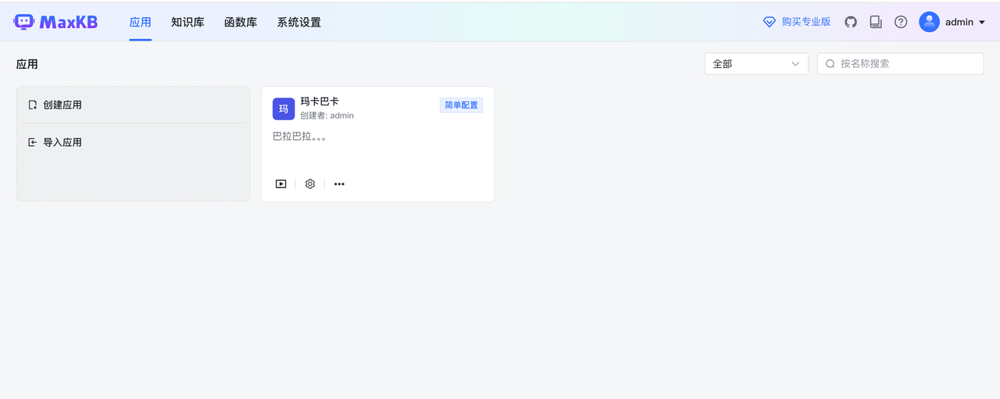

4. 或者也可以使用docker桌面端，可视化安装。
   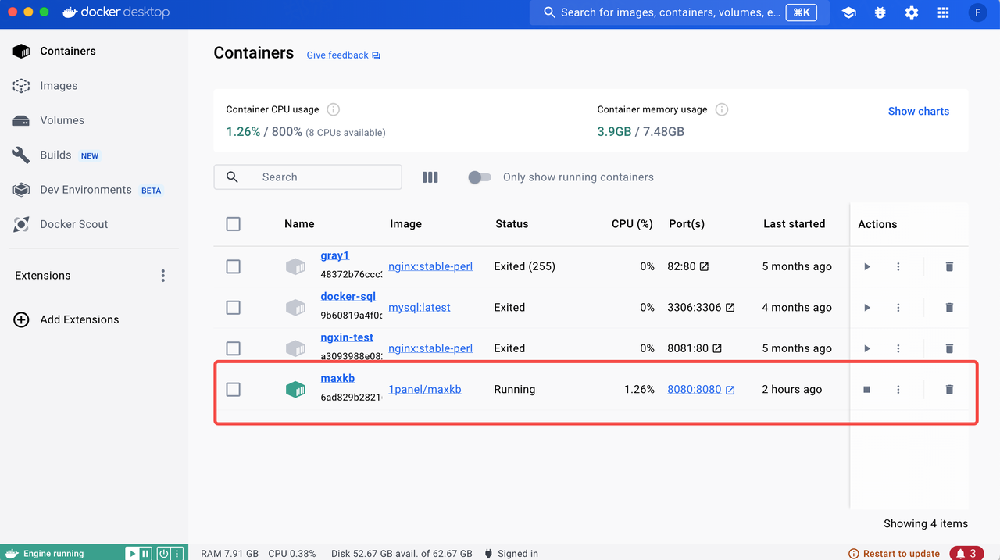
   MaxKB启动之后，先放着，之后再详情介绍如何关联DeepSeek。

## 3. DeepSeek本地部署

DeepSeek之所以强大，是因为它是强化学习模式，而传统的大模型是指令式的。
指令式学习（Instruction-based learning）通常是基于监督学习的方式，模型通过训练数据中明确的输入和输出对来学习。也就是说，训练数据包含了特定的任务指令，模型根据这些指令进行推理并输出对应的结果。这种方式侧重于模型学习如何根据人类的指令来执行任务。训练过程中，模型通过大量标注数据来优化其表现。
强化学习（Reinforcement Learning, RL）则是一种通过与环境互动来学习的方式，模型并不总是依赖于明确的指令，而是通过试错的过程来获取经验并改进策略。在强化学习中，模型通过行动获得奖励或惩罚，从而调整其决策策略，以最大化长期奖励。训练过程则是通过模型与环境之间的互动来逐步调整行为。模型通过接收到的奖励来学习哪些行为是有效的。训练过程可能更加动态，模型需要在实际环境中反复试探才能优化策略。

### 版本选择

本地部署就是自己部署DeepSeek-R1模型，使用本地的算力。
-  主要瓶颈：内存+显存的大小。
- 特点：此方案不用联网。
- 适合：有数据隐私方面担忧的或者保密单位根本就不能上网的。
- 使用满血版：DeepSeek R1 671B 全量模型的文件体积高达720GB，对于绝大部分人而言，本地资源有限，很难达到这个配置

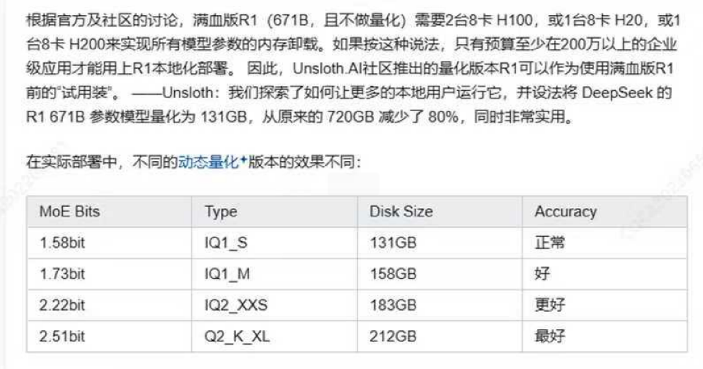

开源2+6个模型。R1预览版和正式版的参数高达660B，非一般 公司能用。为进一步平权，于是他们就蒸馏出了6个小模型， 并开源给社区。最小的为1.5B参数，10G显存可跑。如果你要在个人电脑上部署，一般选择其他架构的蒸馏模 型，本质是微调后的Llama或Qwen模型，基本32B以下，并不能完全发挥出DeepSeek R1的实力。

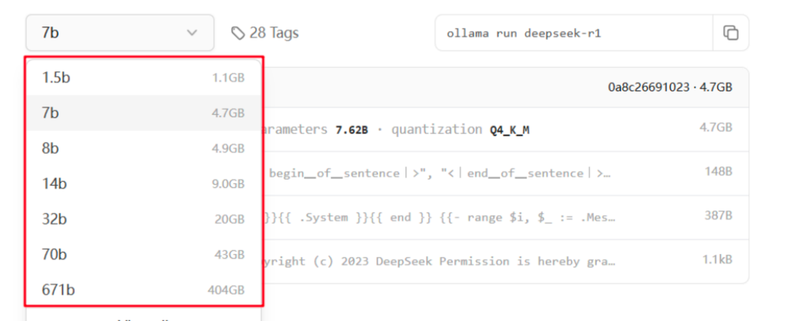

我们以通常选择7B，大多数的电脑都能够运行起来。

### 安装 ollama

在 ollama 官网 ollama.com/ 下载：
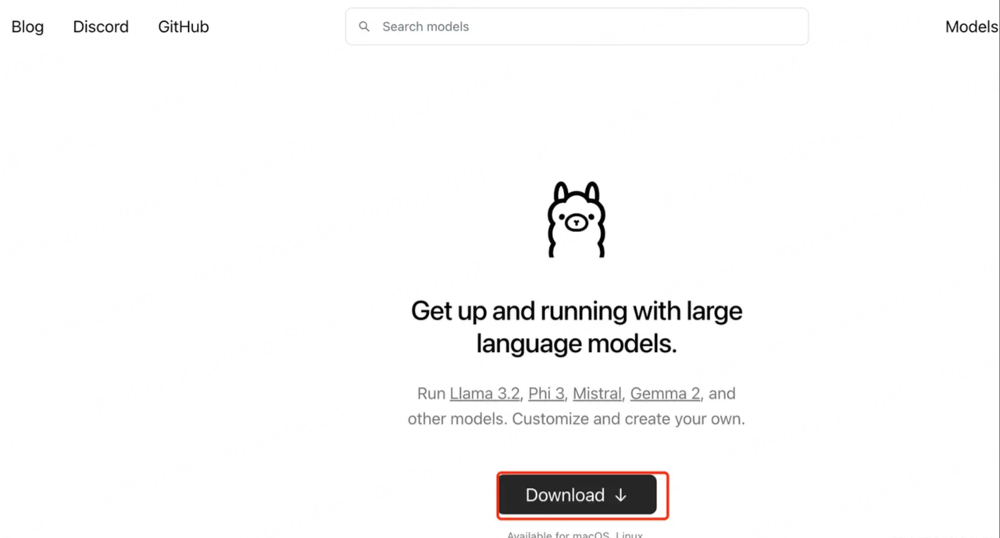

安装后就可以用 ollama 命令了，运行  

> ollama-v

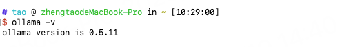
能显示ollama版本说明安装成功。

### 本地安装DeepSeek

运行命令

> ollama run deepseek-r1:7b

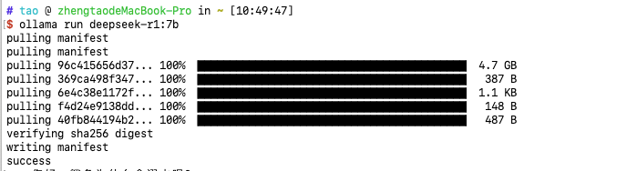

Success 代表安装成功。

运行  /? 获取帮助

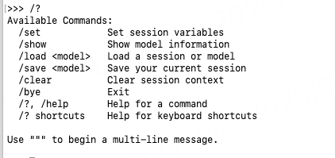

可以直接着在控制台提问
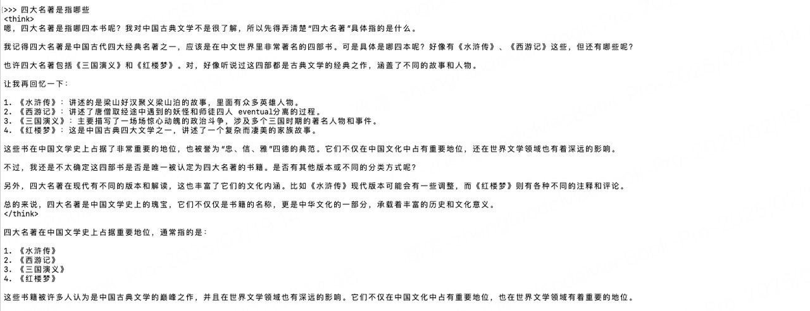

最后，查看已有模型是 ollama list, 退出对话是 /bye。
在控制台中操作不太方便，也太丑了，接下来结合客户端工具来使用。

## 4. MaxKB构建DeepSeek

### 创建知识库
回到MaxKB，选择知识库tab，如下所示：
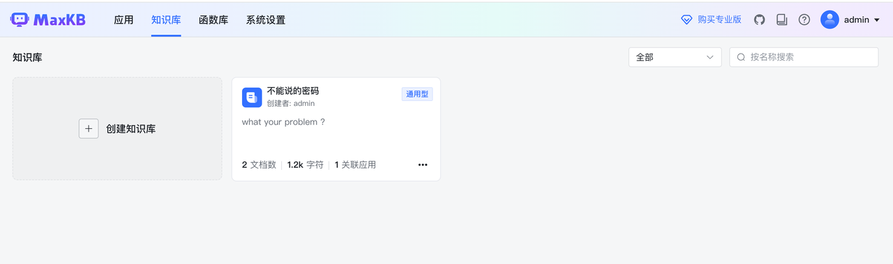

点击创建知识库，新建一个知识库，然后上传本地文件，文档可以是文本的 txt、markdown 等，也可以是表格的 excel、csv 等。
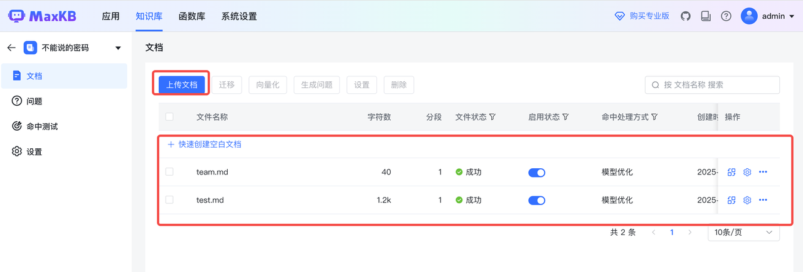

创建知识库的时候也可以选择web站点，如下选了react官网。

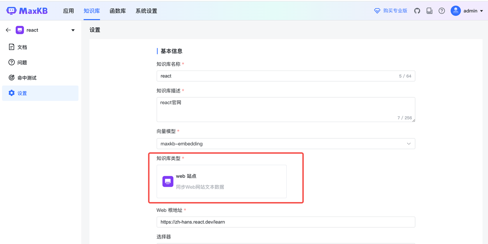

它会自动爬取网站内容

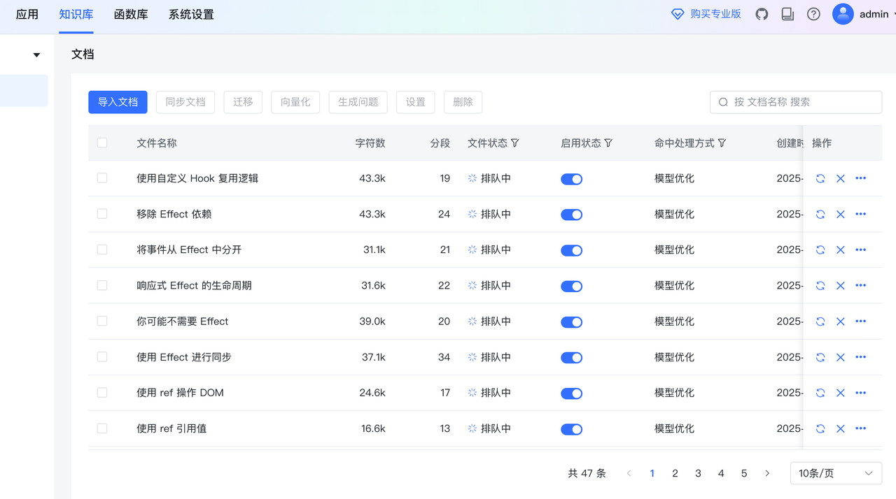

### 创建模型
来到系统设置tab，选择模型设置，然后添加模型，这边选择 Ollama 供应商

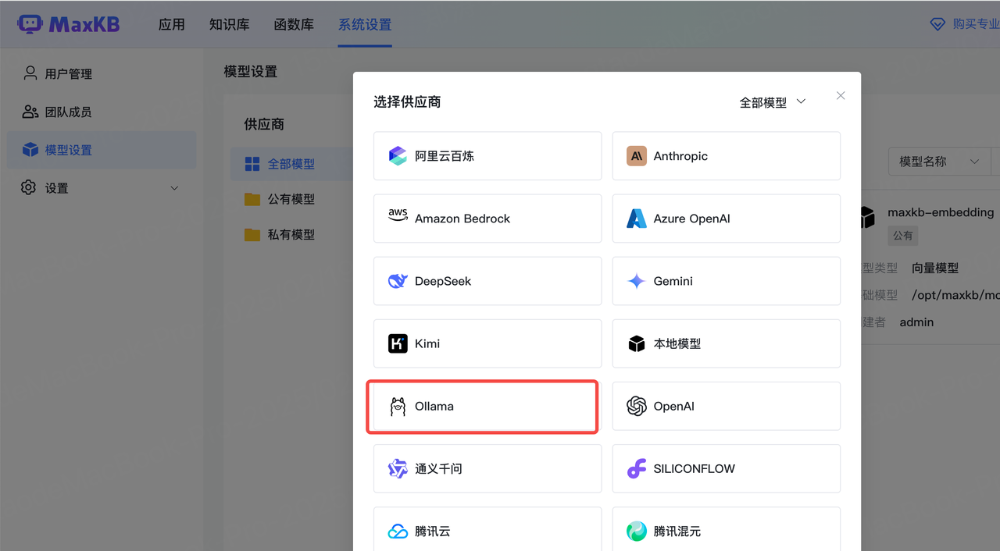

接着创建

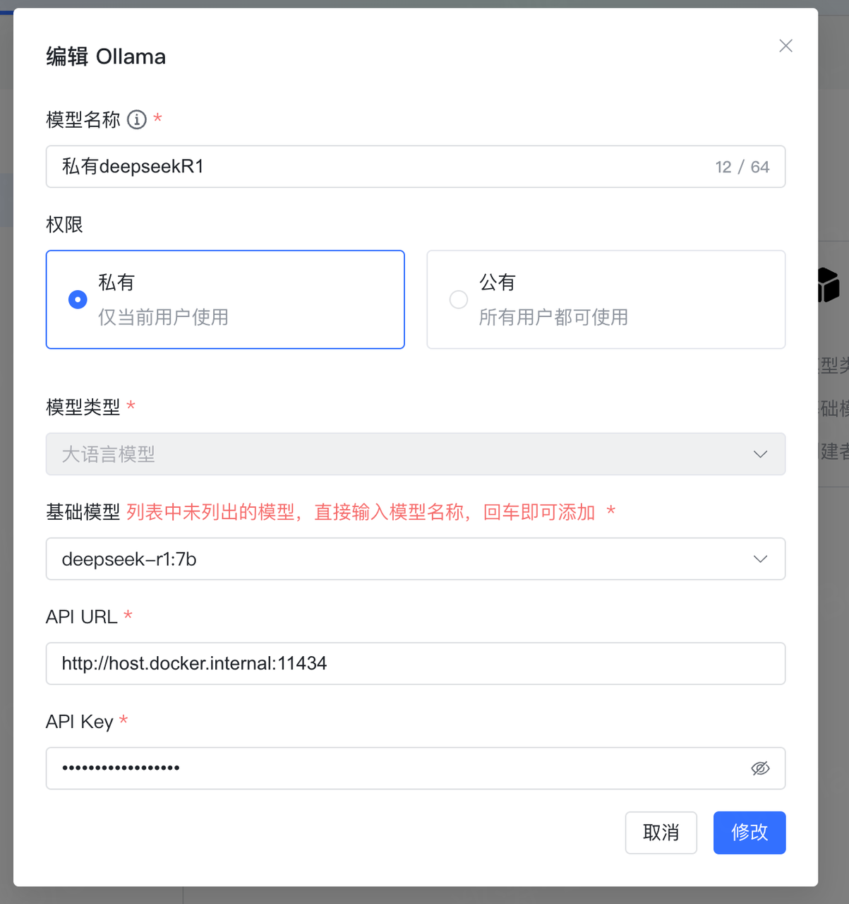

基础模型选择我们安装的 deepseek-r1:7b， 然后API URL填写 host.docker.internal:11434 。
那这边的  host.docker.internal 是什么呢？

::: tip
它是 Docker 提供的一个特殊主机名，用于在 Docker 容器内访问宿主机（Host Machine）。它主要用于解决 Docker 容器内部访问宿主机服务的问题，尤其是在 Windows 和 macOS 系统上。在本地私有化部署 DeepSeek-R1:7b 模型并计划与 MaxKB 集成时， 要配置 MaxKB 以连接到本地运行的 DeepSeek 模型。通常情况下，DeepSeek 模型通过 Ollama 等工具在本地运行，其默认的 API 地址为 http://localhost:11434。然而，当 MaxKB 以 Docker 方式运行时，可能需要使用 http://host.docker.internal:11434 作为 API 地址，以确保 Docker 容器内的 MaxKB 能正确访问主机上的 DeepSeek 服务。
:::

接着 API Key 随便填写都可以，提交保存。

### 创建应用

输入应用名

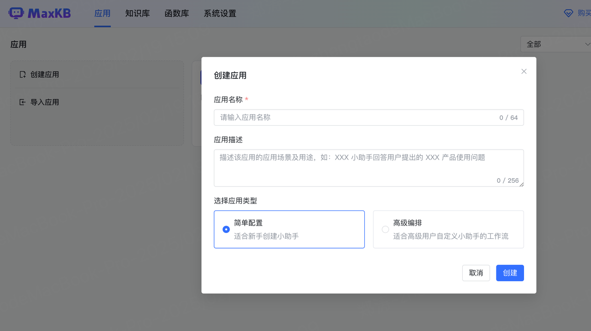

然后关联知识库

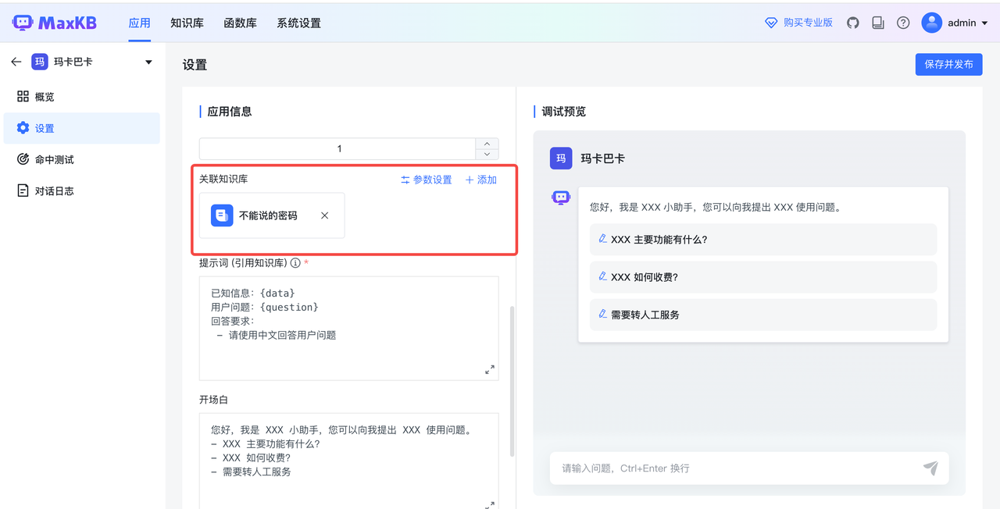

然后这边可以看到 BASE URL 和 API KEY，这个API KEY 首次需要自己创建一个。这个秘钥后面有用到。
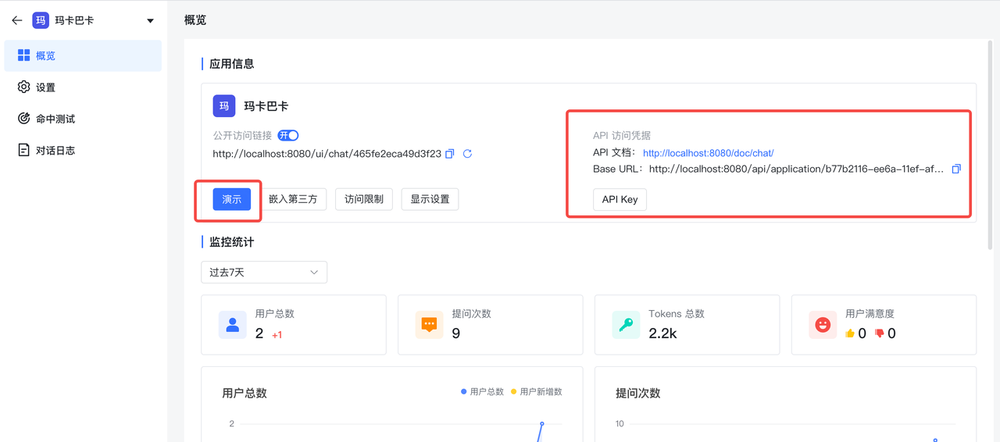

这边点击【演示】，可以结合知识库愉快的问问题了。比如我问了，朴朴前端谁最帅。

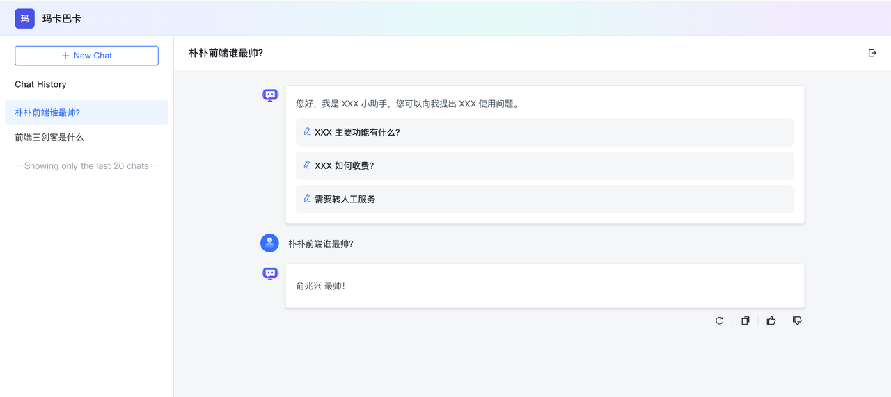

虽然可以通过可视化面板交互了，但是能不能更定制一步呢？答案是可以的。

## 5. 调用API 生成回答
接下来我们创建一个项目

```js
mkdir openai-test
cd openai-test
npm init -y
```
安装下 openai 的包：

```bash
pnpm add  openai
```
package.json 配置  "type": "module"
然后创建 src/index.js
项目结构如图：

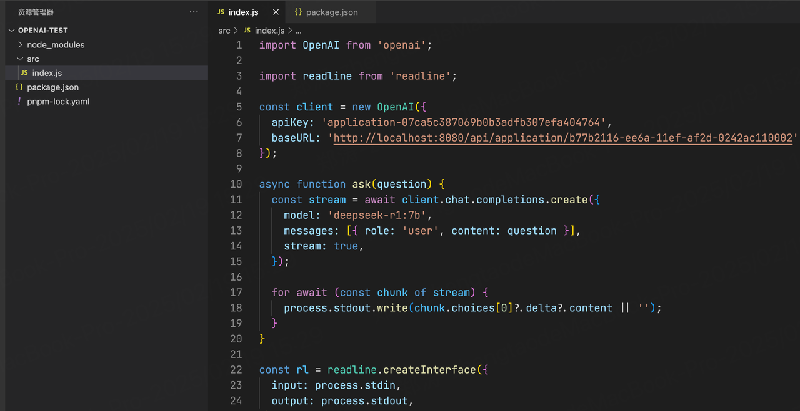

代码内容为：

```js
import OpenAI from 'https://www.npmjs.com/package/openai';
import readline from 'readline';

const client = new OpenAI({
  // 替换为应用的 apiKey
  apiKey: 'application-07ca5c387069b0b3adfb307efa404764',
  // 替换为应用的 Base URL
  baseURL: 'http://localhost:8080/api/application/b77b2116-ee6a-11ef-af2d-0242ac110002',
});

async function ask(question) {
  const stream = await client.chat.completions.create({
    model: 'deepseek-r1:7b', // 替换自己的模型
    messages: [{ role: 'user', content: question }],
    stream: true,
  });

  for await (const chunk of stream) {
    process.stdout.write(chunk.choices[0]?.delta?.content || '');
  }
}

const rl = readline.createInterface({
  input: process.stdin,
  output: process.stdout,
});

const askQuestion = (question) => {
  return new Promise((resolve) => {
    rl.question(`\n${question}\n\n：`, (answer) => resolve(answer)); // 在问题前后加换行
  });
};

const main = async () => {
  const question = await askQuestion('有什么想问的，我可以帮助你。 ');
  await ask(question);
  rl.close();
};

main();
```

**create 属性**
- model 是指定用哪个模型。
- messages 是上下文，也就是聊天记录。
- stream 指定 true 就是流式返回内容。
- 其中需要注意的是apiKey和baseURL，它分别对应到具体应用 apiKey 和 Base UR

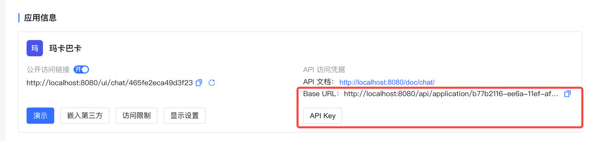

具体 openai 的用法可以查看npm官网： https://www.npmjs.com/package/openai

最后展示一下运行效果（有点慢）：
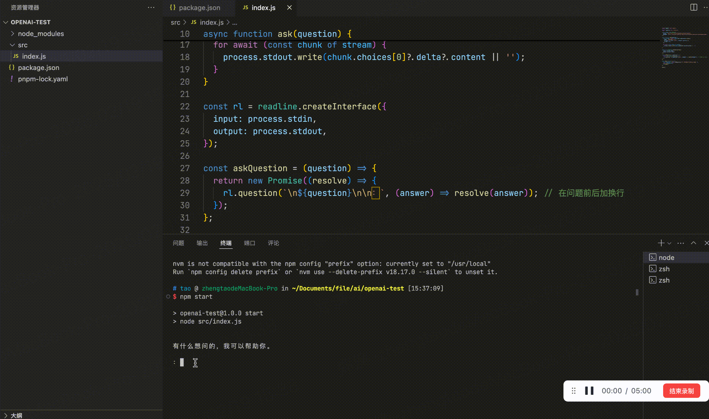

## 6. 工具

1. 因为DeepSeek经常提示系统繁忙，这边推荐使用 [秘塔搜索](https://metaso.cn/)，R1满血版。 
  
2. 因为DeepSeek现在充值不了，可以使用 [硅基流动](https://siliconflow.cn/) 充值。 

## 7. AI学习

网上看到一个学习ai的资料，有精力的同学可以学习，[通往AGI之路](https://waytoagi.feishu.cn/wiki/QPe5w5g7UisbEkkow8XcDmOpn8e)。


## 8. 总结

本文介绍了利用 MaxKB 搭建知识库，并本地私有化部署了DeepSeek。然后MaxKB 结合DeepSeek实现自己的私人ai小助理。最后通过结合node的openid库，调用API的方式，集成到自己的内部应用。所以它的应用空间是非常广阔的。
