# Web性能优化

说起web性能优化，你是否脑海涌现一堆的解决方案。那能否系统性的整理归纳性能优化方案呢？本文从性能优化的指标，到测量工具，再到优化方的具体方案展开逐一展开讨论。

## 概述

### 什么是web性能？

MDN上归纳为：Web性能是网站或应用程序的客观度量和可感知的用户体验。

### 具体表现有哪些？

- 减少整体加载时间：减小文件体积、减少HTTP请求、使用预加载
- 使网站尽快可用：仅加载首屏内容，其它内容根据需要进行懒加载
- 平滑和交互性：使用CSS替代S动画、减少UI重绘
- 感知表现：你的页面可能不能做得更快，但你可以让用户感觉更快。耗时操作要给用户反
馈，比如加载动画、进度条、骨架屏等提示信息
- 性能测定：性能指标、性能测试、性能监控持续优化
  
### 如何进行Web性能优化？

1. 首先需要了解性能指标-多快才算快？
2. 使用专业的工具可量化地评估出网站或应用的性能表现：
3. 然后立足于网站页面响应的生命周期，分析出造成较差性能表现的原因；
4. 最后进行技术改造、可行性分析等具体的优化实施。
5. 迭代优化

## web性能指标介绍

### RAIL性能模型

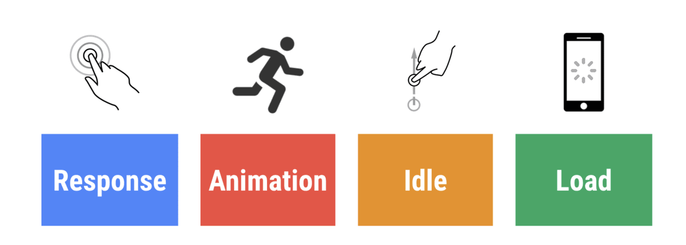

RAIL 是 Response, Animation, Idle, 和 Load 的首字母缩写, 是一种由 Google Chrome 团队与 2015 年提出的性能模型，用于提升浏览器内的用户体验和性能。RAIL 模型的理念是 "以用户为中心；最终目标不是让你的网站在任何特定设备上都能运行很快，而是使用户满意。" RAIL 把交互分为四个阶段：页面加载，空闲，响应用户输入，滚动和动画。按首字母缩写顺序，其主要原则是：
- 响应(Response):应该尽可能快速的响应用户，应该在100ms以内响应用户输入。
- 动画(Animation):在展示动画的时候，每一帧应该以16ms进行渲染，这样可以保持动画效果的一致性，并且避免卡顿。
- 空闲(Idle)：当使用Javascript主线程的时候，应该把任务划分到执行时间小于50ms的片段中去，这样可以释放线程以进行用户交互。
- 加载(Lod):应该在小于1s的时间内加载完成你的网站，并可以进行用户交互。
  
### 以用户为中心的效果指标

我们都听说过性能非常重要。但是，当我们谈论性能以及提高网站“快速”的速度时，具体指的是什么呢？在讨论性能时，必须保持精确性，并按照可通过量化衡量的客观标准来指代性能。主要有以下指标。
- First Contentful Paint (FCP)：用于衡量从网页开始加载到网页任何部分的内容呈现在屏幕上所用的时间。
- Largest Contentful Paint (LCP)：衡量从网页开始加载到屏幕上呈现最大的文本块或图片元素所用的时间。
- First Input Delay (FID)：衡量从用户首次与您的网站互动（点击链接、点按按钮或使用由 JavaScript 提供支持的自定义控件）到浏览器实际能够响应该互动的时间。
- Interaction to Next Paint (INP)：用于衡量与网页进行的每一次点按、点击或键盘互动的延迟时间，并根据互动次数选择网页的最差互动延迟时间（或接近最高延迟时间）作为单个代表性值，以描述网页的整体响应速度。
- Time to Interactive (TTI) ：表示网页第一次完全达到可交互状态的时间点，浏览器已经可以持续性的响应用户的输入。
- Total Blocking Time (TBT): 测量 FCP 和 TTI 之间的总时间，在此期间主线程处于阻塞状态的时间足够长，足以阻止输入响应。
- Cumulative Layout Shift (CLS)：衡量从页面开始加载到其生命周期状态更改为隐藏期间发生的所有意外布局偏移的累计得分。
- Time to First Byte (TTFB): 测量网络使用资源的第一个字节响应用户请求所需的时间。

### Web Vitals

Web Vitals指核心网页指标，这组策略侧重于用户体验的三个方面：加载、互动和视觉稳定性。它包括以下指标：
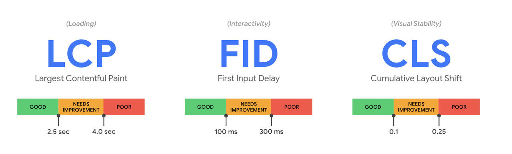
- Largest Contentful Paint (LCP)：衡量加载性能。 为了提供良好的用户体验，LCP 必须在网页首次开始加载后的 2.5 秒内发生。
- First Input Delay (FID)：衡量互动。为了提供良好的用户体验，页面的 FID 不得超过 100 毫秒。
- Cumulative Layout Shift (CLS)：衡量视觉稳定性。为了提供良好的用户体验，必须将 CLS 保持在 0.1. 或更低。
- 
### web性能测试工具

### chrome插件分析
chrome应用商店搜索web vitals 下载安装，可以查看对应网页指标测量结果：
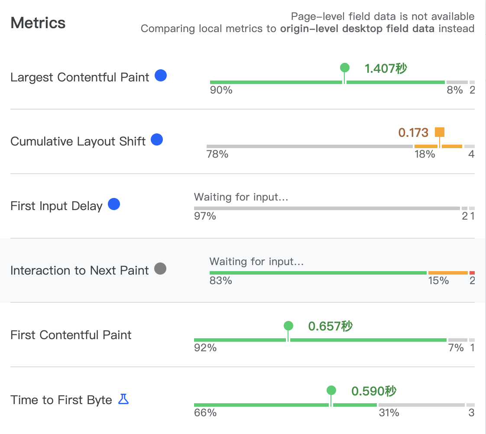

### 通过performance.timing分析
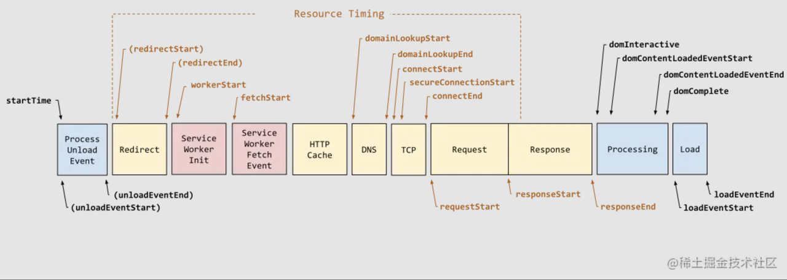
属性的含义和测量方法可以参考 [perfprmance性能分析指标](https://juejin.cn/post/7268221660527919156?searchId=20240225203838C17234926CADEDF04185)，这边就不介绍了。

### NPM 包
通过下载npm的 web-vitals 包来使用，具体点击 [传送门](https://github.com/GoogleChrome/web-vitals) 查看。

```js
// 安装
npm install web-vitals

// 使用
import {onLCP, onFID, onCLS} from 'web-vitals';
onCLS(console.log);
onFID(console.log);
onLCP(console.log);
```

### 第三方网站分析
这边推荐三个网站pagespeed 、  webpagetest 、 debuggerBear。该网站不仅能分析性能问题点，还能给出对应的解决方案。还提供了文档，教我们怎么分析查看分析结果。这个是测试知乎首页的分析结果，页面包含了Web Vitals、 Request 等。
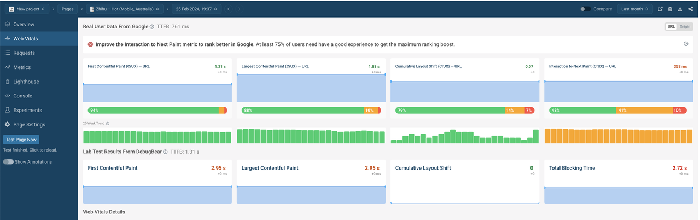
还提供了查看分析指标的文档，这边介绍了如何查看 NetWork 的瀑布流：
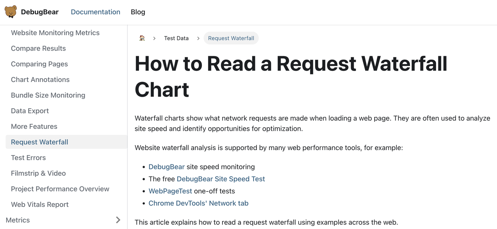
### Chrome Devtools性能测试
这边主要介绍 NetWork 和 Perfomance面板，以及Coverage覆盖率测试。

**NetWork面板**

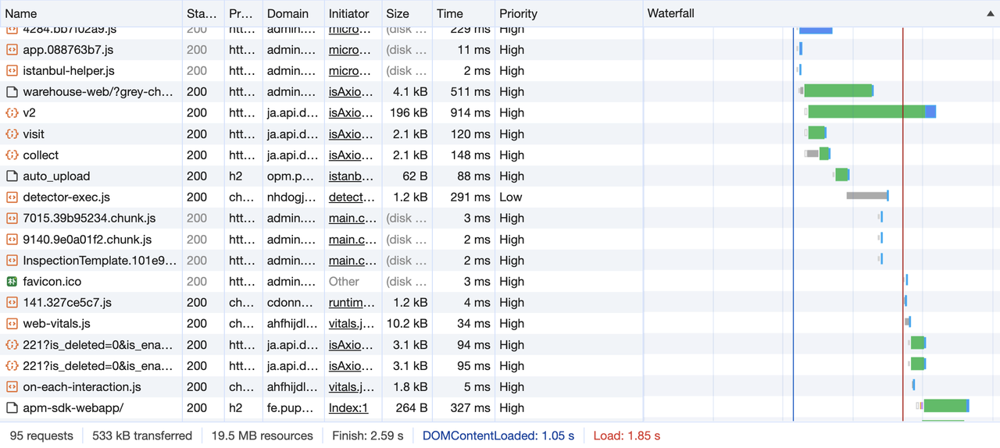

**Perfomance面板**

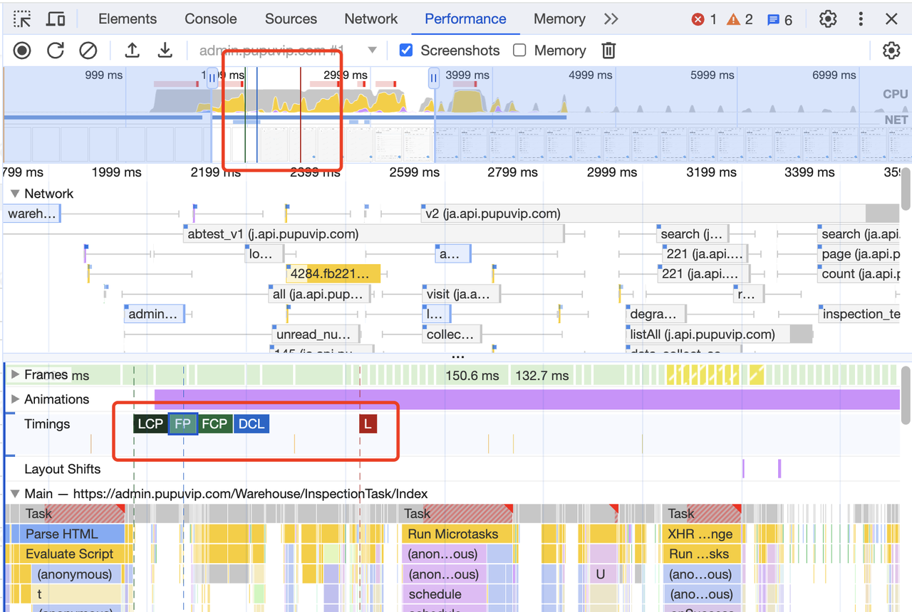

**Coverage分析工具**

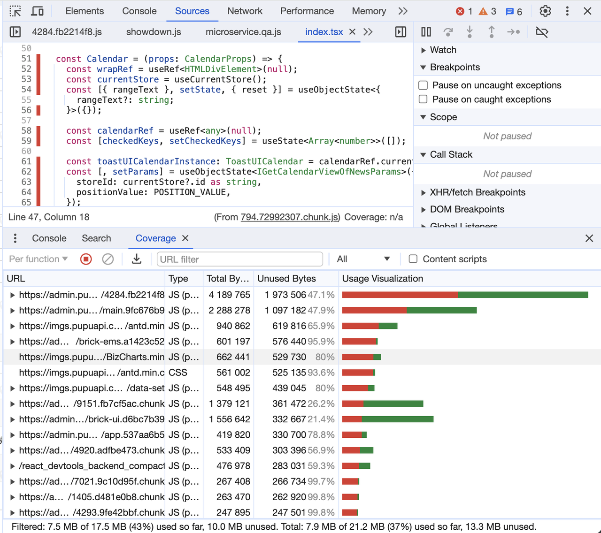

Coverage 表格展示了录制过程中加载的所有 JS 和 CSS 文件，以及每个文件的大小、运行时覆盖率，汇总数据展示在页面底部的状态栏中。正常情况下webpack已经 Tree Shaking ，但是 Coverage 数据还是居高不下， 可以考虑下code-splitting。

Chrome Devtools除了这些面板之外，还有Lighthouse 和 Memory等面板，这边就不逐一介绍了。具体想深入了解可以点击[devtools](https://developer.chrome.com/docs/devtools)文档查看。

## web优化方法

前端页面的生命周期
我们经常会遇到一个面试题，浏览器从输入URL到页面渲染加载的过程 的面试题，其实这个问题的回答可以非常细致，能从信号与系统、计算机原理、操作系统、浏览器内核，再到DNS解析、负载均衡、页面渲染等。而性能优化刚刚好可以从这个过程中来详情展开：

1. 浏览器接收到URL,到网络请求线程的开启。
2. 一个完整的HTTP请求并的发出。
3. 服务器接收到请求并转到具体的处理后台。
4. 前后台之间的HTTP交互和涉及的缓存机制。
5. 浏览器接收到数据包后的关键渲染路径。
6. JS引擎的解析过程。
  
### 请求响应优化

目的是更快的内容到达时间。核心思路：

1. 更好的连接传输效率
2. 更少的请求数量
3. 更小的资源大小
4. 合适的缓存策略
  
具体方法如下：

### 减少DNS查询

每次主机名的解析都需要一次网络往返，从而增加了请求的延迟时间，同时还会阻塞后续的请求。
DNS的缓存有浏览器缓存和系统缓存，正常情况下chrome浏览器的缓存时间为1分钟，而系统缓存可以根据自己的需求配置，如下图，域名解析的时候配置：
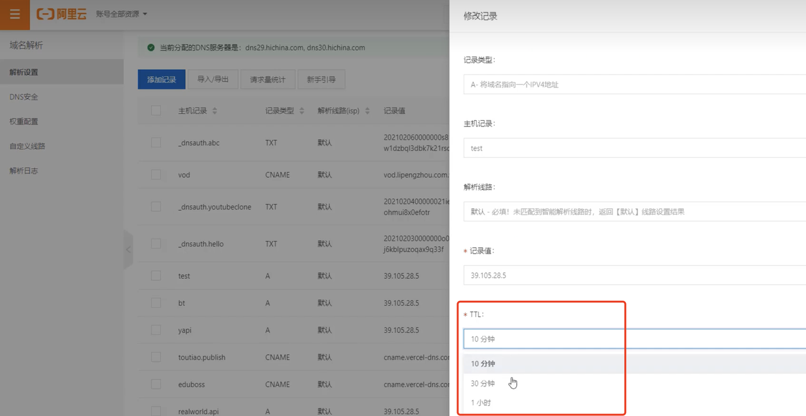

接口请求具体的DNS查找时间可以在Timing面板中查看，如下图：
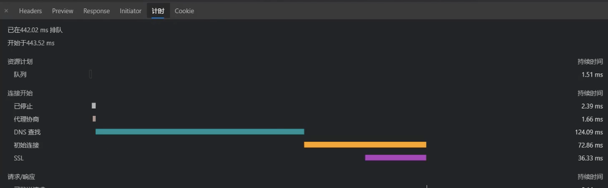

Timing很好的解释了请求从发起到数据返回的各个时间节点消耗的时间，下图是各个时间节点的解释：
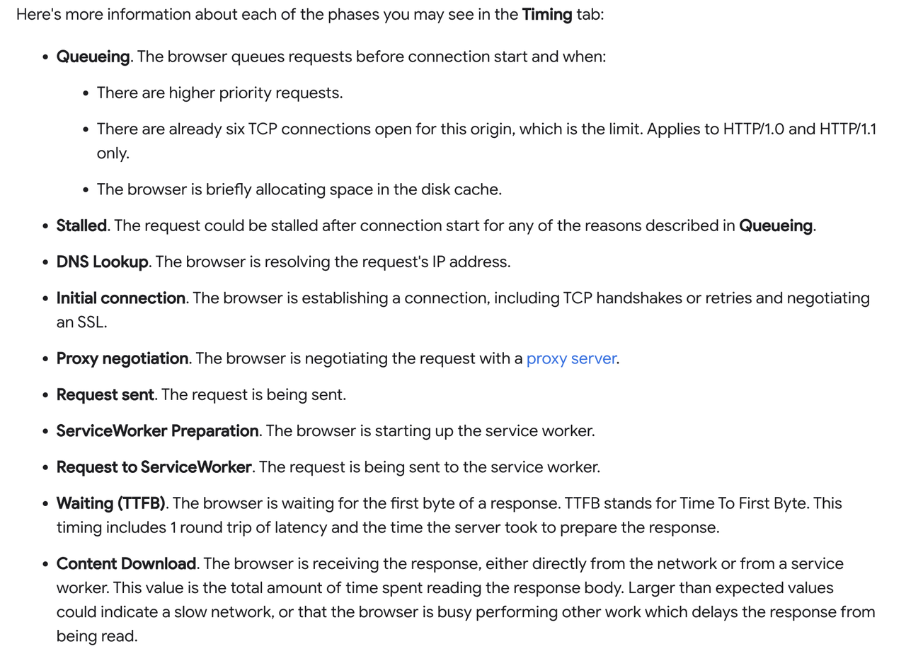

当客户端的DNS缓存为空（对于浏览器和操作系统）时，DNS查找的次数等于网页中唯一主机名的数目。这包括在页面的URL,图像，脚本文件，样式表，Flash对象等中使用的主机名。减少唯一主机名的数量将减少DNS查找的数量。**所以减少域名的数量有可能减少页面中并行下载的数量，因为在 HTTP/1.0 和 HTTP/1.1情况下，一个域名只能打开 6 个 TCP 连接（达到上限）**。虽然DNS查找会减少响应时间，但是并行下载可能会增加响应时间。建议是将这些资源划分为至少两个但不超过四个域名。这将在减少DNS查找和允许高度并行下载之间取得良好的折衷。

### DNS-prefetch

DNS-prefetch(DNS预获取)是尝试在请求资源之前解析域名。这可能是后面要加载的文件，也可能是用户尝试打开的链接目标。域名解析和内容载入是串行的网络操作，所以这个方式能减少用户的等待时间，提升用户体验。DNS-prefetch可帮助开发人员掩盖DNS解析延迟。HTML的 link 元素通过rel设置dns-prefetch属性值，然后在href属性中指要跨域的域名，具体如下：

```js
<link rel="dns-prefetch" href="https://fonts.googleapis.com/">
```

淘宝的DNS-prefetch使用：

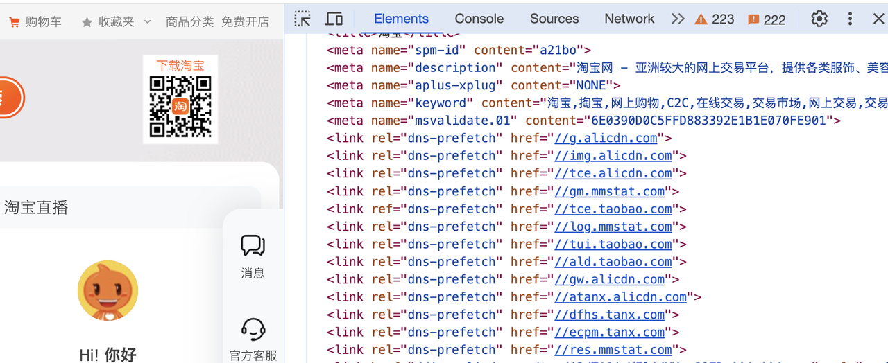

### 重用TCP连接
重用tcp连接尽可能的使用持久连接，以消除因TCP握手和慢启动导致的延迟。

**HTTP**/1.0
主要特性：短连接。

HTTP/1.**1**
主要特性： 持久连接，管道机制。

HTTP1.1版的最大变化，就是引入了持久连接(HTTP Persistent Connections),即TCP连接默认不关闭，可以被多个请求复用，不用声明Connection:keep-alive。虽然HTTP1.1版允许复用TCP连接，但是同一个TCP连接里面，所有的数据通信是按次序进行的。服务器只有处理完一个回应，才会进行下一个回应。要是前面的回应特别慢，后面就会有许多请求排队等着。这称为"队头堵塞"(Head-of-line blocking)。为了避免这个问题，只有两种方法：

1. 减少请求数
2. 同时多开持久连接

这导致了很多的网页优化技巧，比如合并脚本和样式表、将图片嵌入CSS代码、域名分片(domain sharding)等等。如果HTTP协议设计得更好一些，这些额外的工作是可以避免的。

### HTTP2

主要特性：多路复用。
具体想知道HTTP版本之间的区别，可以查看文章  解读 HTTP1/HTTP2/HTTP3
配置HTTP2首先要域名要配置SSL证书，接着配置Nginx。公司已经接入了HTTP2。如下图：
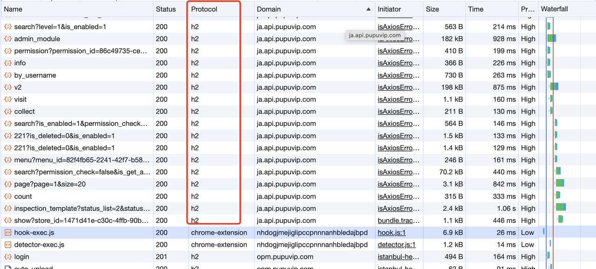

### 减少HTTP重定向

HTTP重定向需要额外的DNS查询、TCP握手等非常耗时，最佳的重定向次数为0。
压缩传输的资源
比如Gzip、图片压缩。
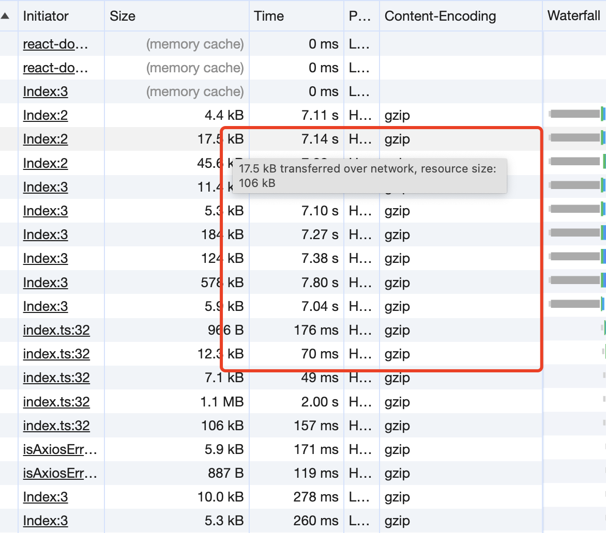

### 合理使用缓存
HTTP 缓存  和 Service Worker等缓存。

### 使用CDN内容分发网络
CDN全称Content Delivery Network,即内容分发网络，它是构建在现有网络基础上的虚拟智能网络，依靠部署在各地的边缘服务器，通过中心平台的负载均衡、调度及内容分发等功能模块，使用户在请求所需访问的内容时能够就近获取，以此来降低网络拥塞，提高资源对用户的响应速度。把数据放在离用户地理位置更近的地方，可以明显减少每次TCP连接的网络延迟，增大吞吐量。
CDN网络能够缓存网站资源来提升首次请求的响应速度，但并非能适用于网站所有资源类型，它往往仅被用来存放网站的静态资源文件。所谓静态资源，就是指不需要网站业务服务器参与计算即可得到的资源，包括第三方库的JavaScript脚本文件、样式表文件及图片等，这些文件的特点是访问频率高、承载流量大，但更新修改频次低，且不与业务有太多耦合。

图片的话可以使用CDN 图床尺寸大小压缩，CDN配合业务具体实现：**使用 img 标签 srcset/sizes 属性和 picutre 标签实现响应式图片，具体可参考文档，使用URL动态拼接方式构造url请求，根据机型宽度和网络情况，判断当前图片宽度倍数进行调整（如iphone 1x，ipad 2x，弱网0.5x）。**

### 内容在传输前先压缩

传输数据之前应该先压缩应用资源，把要传输的字节减少到最小，在压缩的时候确保对每种不同的资源采用最好的压缩手段。不过也需要考虑，解压所需要的时间，可以根据实际情况做处理。

### 消除不必要的请求开销

减少请求的HTTP首部数据 (比如HTTP Cookie)。
主站请求的域名为www.taobao.com,而静态资源请求CDN服务器的域名有g.alicdn.com和img.alicdn.com两种，它们是有意设计成与主站域名不同的，这样做的原因主要有两点：第一点是避免对静态资源的请求携带不必要Cookie信息，第二点是考虑浏览器对同一域名下并发请求的限制。

### 渲染优化

浏览器从获取HTML到最终在屏幕上显示内容需要完成以下步聚：

1. 处理HTML标记并构建DOM树。
2. 处理CSS标记并构建CSSOM树。
3. 将DOM与CSS DOM合并成一个render tree。
4. 根据渲染树来布局，以计算每个节点的几何信息。
5. 将各个节点绘制到屏幕上。
   
### DOM优化

HTML文件的尺寸应该尽可能的小，目的是为了让客户端尽可能早的接收到完整的HTML。通常HTML中有很多冗余字符，例如：JS注释、CSS注释、HTML注释、空格、换行。更糟糕的情况是我见过很多生产环境中的HTML里面包含了很多废弃代码，这可能是因为随着时间的推移，项目越来越大，由于种种原因从历史遗留下来的问题不过不管怎么说，这都是很槽糕的。对于生产环境来说，应该删除一切无用的代码，尽可能保证HTML文件精简。
总结起来有三种优化方式:缩小文件的尺寸(Minify)、使用gzip压缩(Compress)、使用缓存(HTTPCache)。

### 样式优化

CSS是构建渲染树的必备元素，首次构建网页时，JavaScript常常受阻于CSS。确保将任何非必需的CSS都标记为非关键资源（例如打印和其他媒体查询），并应确保尽可能减少关键CSS的数量，以及尽可能缩短传送时间。除了上面提到的优化策略，CSS还有一个可以影响性能的因素是：CSS会阻塞关键渲染路径。

### 申明样式加载条件

以下css不阻塞渲染

```js
<link href="print.css" rel="stylesheet" media="print">
<link href="other.css" rel="stylesheet" media="(min-width:40em)">
<link href="portrait.css" rel="stylesheet" media="orientation:portrait">
```

### 避免使用@import

使用@import引入CSS会影响浏览器的并行下载。使用@import引用的CSS文件只有在引用它的那个css文件被下载、解析之后，浏览器才会知道还有另外一个css需要下载，这时才去下载，然后下载后开始解析、构建render tree等一系列操作。这就导致浏览器无法并行下载所需的样式文件。

### critters-webpack-plugin

一款webpack的插件，它可以很方便的配置内联关键css( critical CSS ),其余的非关键css部分则会异步加载。具体使用可以查看 critters。

### JavaScript优化

**js加载优化**
所有文本资源都应该让文件尽可能的小，JavaScript也不例外，它也需要删除未使用的代码、缩小文件的尺寸(Minify)、使用gzip压缩(Compress)、使用缓存(HTTPCache)。

1. 异步加载JavaScript
2. 避免同步请求
3. 延迟解析JavaScript
4. 避免运行时间长的JavaScript
可以在script标签上添加defer和async属性来延迟加载JavaScript。defer属性有前后顺序的加载依赖关系，而且async则没有依赖关系，谁先加载完，就先运行谁。

**js运行优化**

1. requestAnimationFrame：使用 requestAnimationFrame替换 setTimeout，如果js实现动画等。
2. requestIdleCallback：当关注用户体验，不希望因为一些不重要的任务（如统计上报）导致用户感觉到卡顿的话，就应该考虑使用requestIdleCallback。
3. Web Worker：主线程通过创建出Worker子线程，可以分担一部分自己的任务执行压力。在Worker子线程上执行的任务不会干扰主线程，待其上的任务执行完成后，会把结果返回给主线程，这样的好处是让主线程可以更专注地处理U交互，保证页面的使用体验流程。
4. 事件节流和防抖。

### 其他优化

构建工具优化比如 webpack vite 等，以及代码UI框架优化如 react vue 等，就不详细做介绍了。

## 最后

最后贴上一个谷歌提供给开发者使用的的网站 [传送门](https://web.dev/explore)。该网站除了文章前面所说的性能指标，也列出了web优化方法。还有一系列的博客文章等都可以学习。
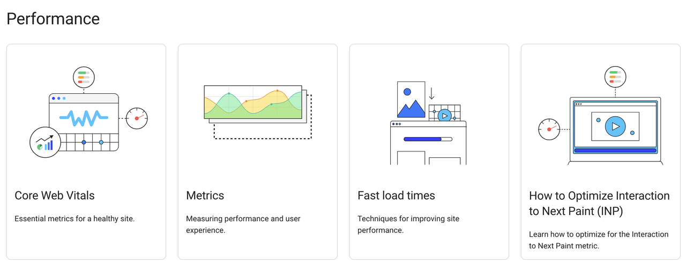
