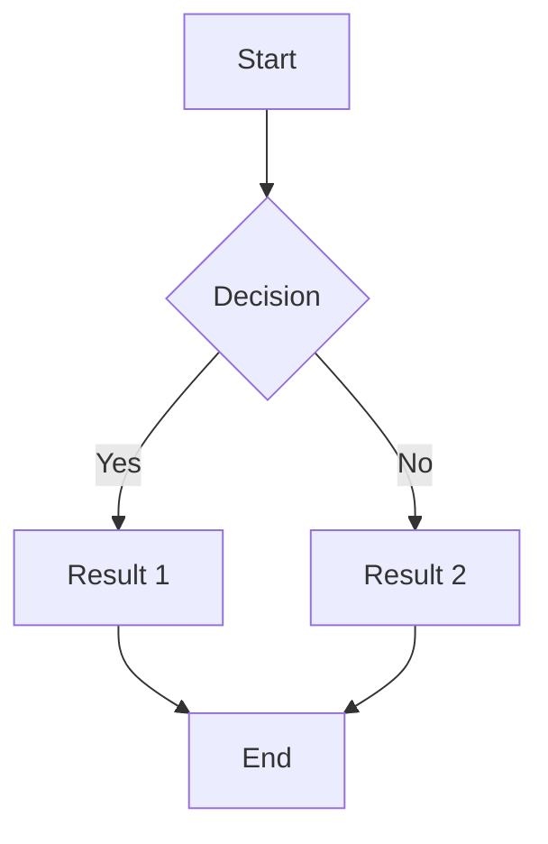
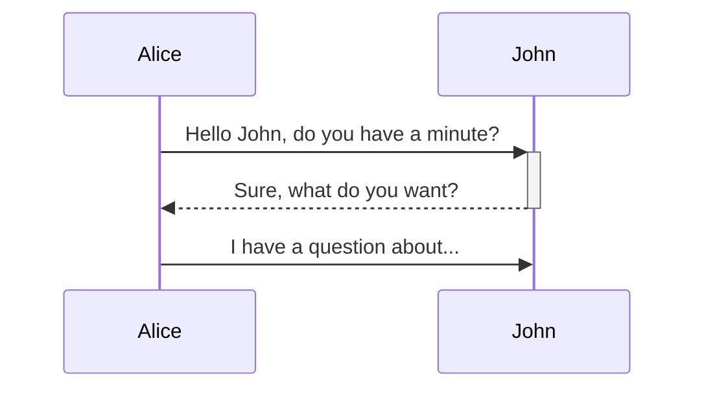
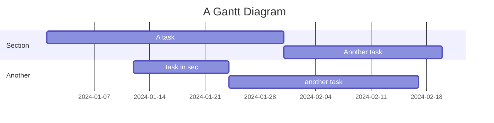
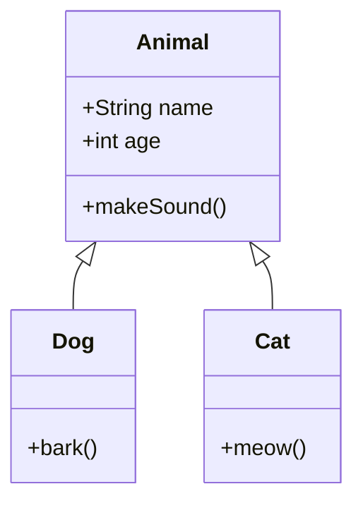
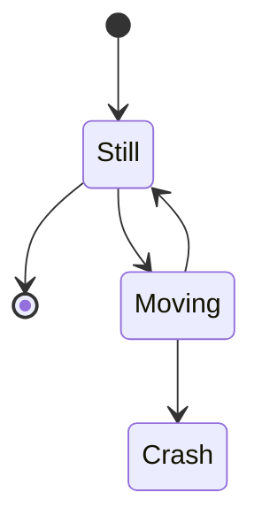
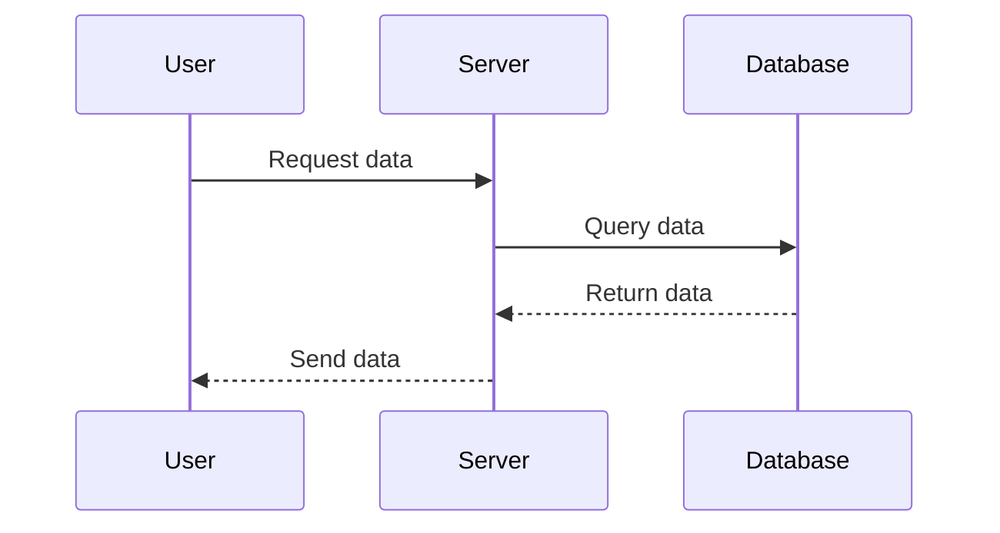

**Mermaid** 是一种用于创建图表和图形的简单文本语法，常用于文档、博客和 Wiki 中。以下是一些常见的 Mermaid 语法示例和基本用法。

### 1. **基本语法**

#### 1.1 流程图



#### 1.2 序列图



#### 1.3 甘特图



#### 1.4 类图



#### 1.5 状态图


#### 1.6 时序图

关键元素
participant: 定义参与者（对象）。
->>: 表示发送消息（箭头指向接收者）。
-->>: 表示返回消息（箭头指向发送者）。
+ 和 -: 用于表示激活和去激活参与者。+ 表示激活，- 表示去激活。



### 2. **使用 Mermaid**

- **在 Markdown 中使用**：许多支持 Markdown 的平台（如 GitHub、GitLab 和一些 Wiki）允许直接嵌入 Mermaid 代码。
  
- **在网页中使用**：您可以在 HTML 中使用 Mermaid 库来渲染图表。

```html
<!DOCTYPE html>
<html>
<head>
    <script type="module">
        import mermaid from 'https://cdn.jsdelivr.net/npm/mermaid@10/dist/mermaid.esm.min.mjs';
        mermaid.initialize({ startOnLoad: true });
    </script>
</head>
<body>
    <div class="mermaid">
        graph TD
            A[Start] --> B{Decision}
            B -->|Yes| C[Result 1]
            B -->|No| D[Result 2]
            C --> E[End]
            D --> E
    </div>
</body>
</html>
```

### 3. **总结**

Mermaid 提供了一种简单的方式来创建各种类型的图表和图形，适合用于文档和可视化需求。通过以上示例，可以快速上手并创建自己的图表。