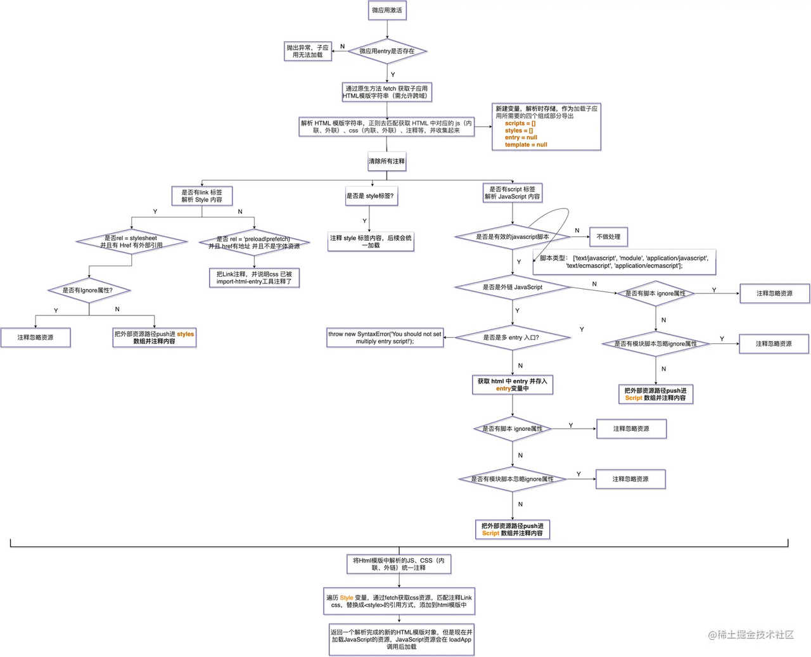
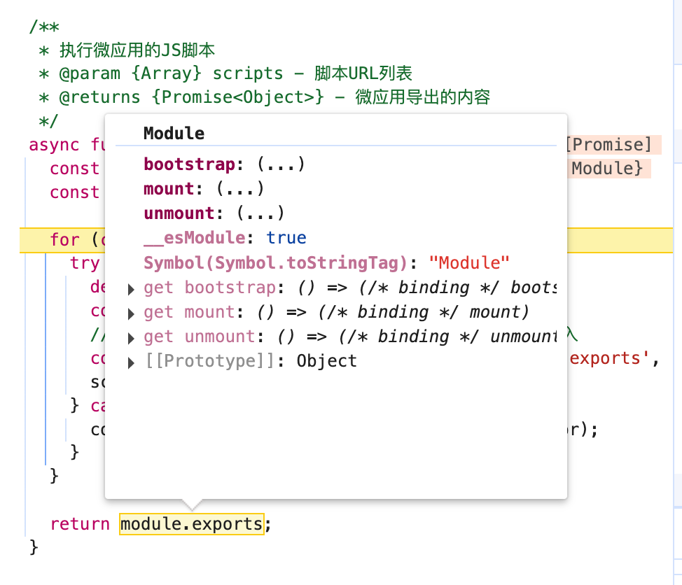
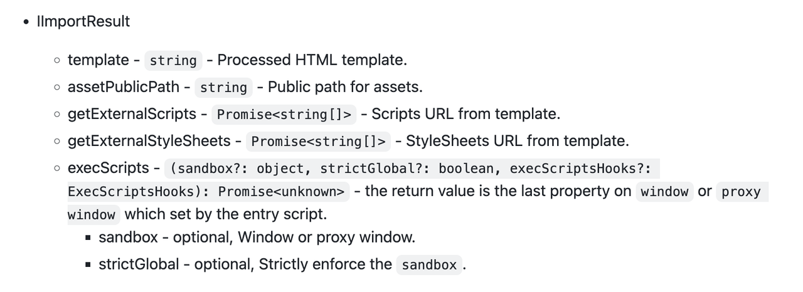
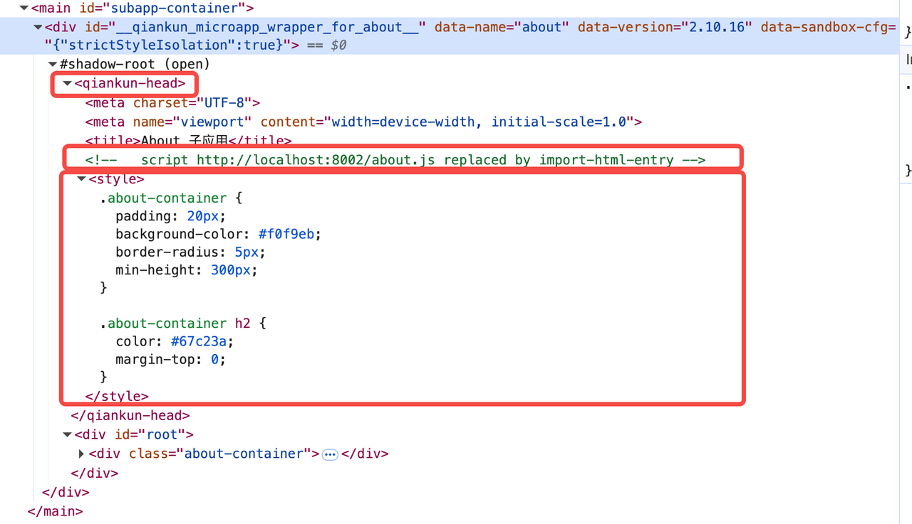
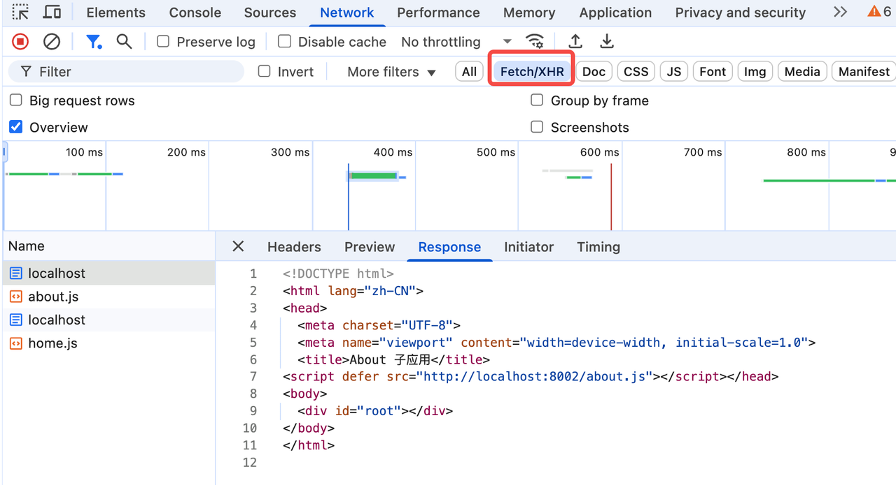

# 手写 qiankun

## 1. 背景

qiankun 是由阿里巴巴团队开源的一款微前端框架，基于 Single-SPA 构建，旨在帮助大家能更简单、无痛的构建一个生产可用微前端架构系统。它支持多种框架（如 React、Vue、Angular 等），并提供了沙箱隔离、样式隔离等特性。深入了解qiankun技术框架有助于全面掌握公司微前端架构的设计原理与实现细节，从而提升系统架构的认知维度与实践水平。

## 2. 手写 qiankun

### 2.1 快速上手qiankun

手写 qiankun之前，先 [快速上手 - qiankun](https://qiankun.umijs.org/zh/guide/getting-started)。

### 2.2 qiankun 加载流程

qiankun总体的加载流程如下：


### 2.3 手写qiankun

根据上面的流程图，简单实现一个qiankun-mini，以深入理解qiankun的加载运行的主要逻辑。qiankun中主要暴露出了registerMicroApps 和 start 两个方法。

> import { registerMicroApps, start } from 'qiankun';

手写qiankun-mini，主要也是对这个两个方法进行高度还原，点击获取完整的项目地址。其中手写的qiankun-mini的源码如下：

```js
/**
 * 简化版qiankun微前端框架
 * 实现了基本的应用注册、加载和生命周期管理功能
 */
window.__POWERED_BY_QIANKUN__ = true;
// 存储已注册的微应用列表
let microApps = [];

// 当前激活的微应用
let activeApp = null;

// 是否已启动
let isStarted = false;

/**
 * 注册微应用
 * @param {Array} apps - 微应用配置列表
 * @param {Object} lifeCycles - 全局生命周期钩子
 */
export function registerMicroApps(apps, lifeCycles = {}) {
  microApps = apps.map(app => ({
    ...app,
    status: 'NOT_LOADED', // 初始状态：未加载
    loadedAssets: null, // 加载的资源
    bootstrap: null, // 启动函数
    mount: null, // 挂载函数
    unmount: null, // 卸载函数
  }));
  
  console.log('已注册的微应用:', microApps);
  return microApps;
}

/**
 * 启动微前端框架
 * @param {Object} options - 启动选项
 */
export function start(options = {}) {
  if (isStarted) {
    console.warn('微前端框架已经启动，请勿重复启动');
    return;
  }
  
  isStarted = true;
  console.log('微前端框架启动');
  
  // 初始化路由监听
  initRouteListener();
  
  // 根据当前路由加载对应的微应用
  reroute();
}

/**
 * 初始化路由监听
 */
function initRouteListener() {
  // 监听 popstate 事件
  window.addEventListener('popstate', () => {
    reroute();
  });
  
  // 重写 pushState 和 replaceState 方法
  const originalPushState = window.history.pushState;
  const originalReplaceState = window.history.replaceState;
  
  window.history.pushState = function(...args) {
    originalPushState.apply(this, args);
    reroute();
  };
  
  window.history.replaceState = function(...args) {
    originalReplaceState.apply(this, args);
    reroute();
  };
}

/**
 * 根据当前路由重新加载微应用
 */
function reroute() {
  const { pathname } = window.location;
  // 查找匹配当前路由的微应用
  const app = findAppByRoute(pathname);
  
  // 如果找到匹配的应用且与当前激活的应用不同，则切换应用
  if (app && (!activeApp || activeApp.name !== app.name)) {
    // 卸载当前应用
    if (activeApp) {
      unloadApp(activeApp);
    }
    
    // 加载新应用
    loadApp(app);
  }

  if (!app && activeApp) {
    unloadApp(activeApp);
  }
}

/**
 * 根据路由查找对应的微应用
 * @param {string} route - 当前路由路径
 * @returns {Object|null} - 匹配的微应用配置或null
 */
function findAppByRoute(route) {
  return microApps.find(app => {
    if (typeof app.activeRule === 'string') {
      return route.startsWith(app.activeRule);
    } else if (app.activeRule instanceof RegExp) {
      return app.activeRule.test(route);
    } else if (typeof app.activeRule === 'function') {
      return app.activeRule(route);
    }
    return false;
  });
}

/**
 * 加载微应用
 * @param {Object} app - 微应用配置
 */
async function loadApp(app) {
  console.log(`开始加载微应用: ${app.name}`, app);
  
  try {
    // 更新应用状态
    app.status = 'LOADING';
    
    // 获取微应用的入口资源
    const assets = await fetchAppAssets(app.entry);
    app.loadedAssets = assets;
    
    // 将微应用的JS脚本注入到主应用中
    const appExports = await executeScripts(assets.scripts);
  
    // 获取微应用的生命周期函数
    const { bootstrap, mount, unmount } = getLifecycleFunctions(appExports);
  
    app.bootstrap = bootstrap;
    app.mount = mount;
    app.unmount = unmount;
    
    // 更新应用状态
    app.status = 'LOADED';
    
    // 启动微应用
    await app.bootstrap();

    // 挂载微应用到容器
    const container = document.querySelector(app.container);
    if (!container) {
      throw new Error(`容器 ${app.container} 不存在`);
    }
    container.innerHTML = assets.html;

    
    // 挂载应用
    await app.mount({
      container,
      basename: app.activeRule,
    });
    
    // 更新应用状态和当前激活的应用
    app.status = 'MOUNTED';
    activeApp = app;
    
    console.log(`微应用 ${app.name} 挂载成功`);
  } catch (error) {
    console.error(`加载微应用 ${app.name} 失败:`, error);
    app.status = 'LOAD_ERROR';
  }
}

/**
 * 卸载微应用
 * @param {Object} app - 微应用配置
 */
async function unloadApp(app) {
  if (app.status !== 'MOUNTED') return;
  
  console.log(`开始卸载微应用: ${app.name}`);
  
  try {
    // 执行应用的卸载函数
    await app.unmount();

    // 清空容器内容
    const container = document.querySelector(app.container);
    if (container) {
      container.innerHTML = '';
    }
    
    // 更新应用状态
    app.status = 'NOT_MOUNTED';
    activeApp = null;
    
    console.log(`微应用 ${app.name} 卸载成功`);
  } catch (error) {
    console.error(`卸载微应用 ${app.name} 失败:`, error);
  }
}

/**
 * 获取资源
 * @param {string} url 
 * @returns 
 */
export const fetchResource = url => fetch(url).then(res => res.text());

/**
 * 获取微应用的入口资源
 * @param {string} entry - 微应用的入口URL
 * @returns {Promise<Object>} - 解析出的JS和CSS资源
 */
async function fetchAppAssets(entry) {
  // 确保entry是完整的URL
  const entryUrl = entry.startsWith('http') ? entry : `http:${entry}`;
  
  try {
    // 获取入口HTML
    const html = await fetchResource(entryUrl);
    
    
    // 创建一个临时的DOM解析HTML
    const parser = new DOMParser();
    const doc = parser.parseFromString(html, 'text/html');
    
    // 提取所有JS和CSS资源
    const scripts = Array.from(doc.querySelectorAll('script'))
      .map(  script => {
        const src = script.src;
        if (src) {
          return  fetchResource(src.startsWith('http')? src : new URL(src, entryUrl).href);
        }else {
          return Promise.resolve(script.innerHTML);
        }
      });
    
    return { html, scripts };
  } catch (error) {
    console.error('获取微应用资源失败:', error);
    throw error;
  }
}

/**
 * 执行微应用的JS脚本
 * @param {Array} scripts - 脚本URL列表
 * @returns {Promise<Object>} - 微应用导出的内容
 */
async function executeScripts(scripts) {
  const module = {exports: {}}; 
  const exports = module.exports;

  for (const script of scripts) {
    try {
      const scriptContent = await script;
      // 创建一个新的Function来执行脚本，并将exports对象传入
      const scriptFunction = new Function('module', 'exports', scriptContent);
      scriptFunction(module, exports);
    } catch (error) {
      console.error(`执行脚本 ${scriptUrl} 失败:`, error);
    }
  }
  
  return module.exports;
}

/**
 * 获取微应用的生命周期函数
 * @param {Object} appExports - 微应用导出的内容
 * @returns {Object} - 生命周期函数
 */
function getLifecycleFunctions(appExports) {
  // 默认的生命周期函数
  const defaultLifecycle = {
    bootstrap: async () => {},
    mount: async () => {},
    unmount: async () => {},
  };
  
  // 尝试从不同的导出格式中获取生命周期函数
  const lifecycle = appExports.default || appExports;
  
  return {
    bootstrap: lifecycle.bootstrap || defaultLifecycle.bootstrap,
    mount: lifecycle.mount || defaultLifecycle.mount,
    unmount: lifecycle.unmount || defaultLifecycle.unmount,
  };
}

```

## 3. 代码解析

### 3.1 注册应用

顾名思义registerMicroApps就是注册微前端apps。当微应用信息注册完之后，一旦浏览器的 url 发生变化，便会自动触发 qiankun 的匹配逻辑，所有 activeRule 规则匹配上的微应用就会被插入到指定的 container 中。

```js
import { registerMicroApps, start } from 'qiankun';

registerMicroApps([
  {
    name: 'home',
    entry: '//localhost:8001',
    container: '#subapp-container',
    activeRule: '/home',
  },
  {
    name: 'about',
    entry: '//localhost:8002',
    container: '#subapp-container',
    activeRule: '/about',
  },
]);

```

### 3.2 监听路由

qiankun中的 activeRule 匹配规则是基于single-spa实现的。类似React Router和 Vue Router的实现原理，我们可以手动模拟监听路由变化：

```js
/**
 * 初始化路由监听 history
 */
function initRouteListener() {
  // 监听 popstate 事件
  window.addEventListener('popstate', () => {
    reroute();
  });
  
  // 重写 pushState 和 replaceState 方法
  const originalPushState = window.history.pushState;
  const originalReplaceState = window.history.replaceState;
  
  window.history.pushState = function(...args) {
    originalPushState.apply(this, args);
    reroute();                                               
  };
  
  window.history.replaceState = function(...args) {
    originalReplaceState.apply(this, args);
    reroute();
  };
  
  // onhashchange 
  window.onhashchange = function() {
     console.log('Hash changed to:', window.location.hash);
     reroute();
  };
}
```

路由的history模式，需要监听 popstate pushState replaceState 三种场景变化。而hash模式下，只要监听 onhashchange 就好了。路由变化会触发 reroute 函数执行，reroute 代码如下：

```js
/**
 * 根据当前路由重新加载微应用
 */
function reroute() {
  const { pathname } = window.location;
  // 查找匹配当前路由的微应用
  const app = findAppByRoute(pathname);
  
  // 如果找到匹配的应用且与当前激活的应用不同，则切换应用
  if (app && (!activeApp || activeApp.name !== app.name)) {
    // 卸载当前应用
    if (activeApp) {
      unloadApp(activeApp);
    }
    
    // 加载新应用
    loadApp(app);
  }

  if (!app && activeApp) {
    unloadApp(activeApp);
  }
}
```

### 3.3 加载微应用

reroute 的 核心就是去加载对应的微前端，实现方法为 loadApp：

```js
/**
 * 加载微应用
 * @param {Object} app - 微应用配置
 */
async function loadApp(app) {
  console.log(`开始加载微应用: ${app.name}`, app);
  
  try {
    // 更新应用状态
    app.status = 'LOADING';
    
    // 获取微应用的入口资源
    const assets = await fetchAppAssets(app.entry);
    app.loadedAssets = assets;
    
    // 将微应用的JS脚本注入到主应用中
    const appExports = await executeScripts(assets.scripts);
  
    // 获取微应用的生命周期函数
    const { bootstrap, mount, unmount } = getLifecycleFunctions(appExports);
  
    app.bootstrap = bootstrap;
    app.mount = mount;
    app.unmount = unmount;
    
    // 更新应用状态
    app.status = 'LOADED';
    
    // 启动微应用
    await app.bootstrap();

    // 挂载微应用到容器
    const container = document.querySelector(app.container);
    if (!container) {
      throw new Error(`容器 ${app.container} 不存在`);
    }
    container.innerHTML = assets.html;

    // 挂载应用
    await app.mount({
      container,
      basename: app.activeRule,
    });
    
    // 更新应用状态和当前激活的应用
    app.status = 'MOUNTED';
    activeApp = app;
    
    console.log(`微应用 ${app.name} 挂载成功`);
  } catch (error) {
    console.error(`加载微应用 ${app.name} 失败:`, error);
    app.status = 'LOAD_ERROR';
  }
}

```

### 3.4 代理加载资源

fetchAppAssets根据app应用配置entry入口，通过fetch拦截获取html和js静态资源（真正的qiankun源码是基于import-html-entry 实现）。

```js
/**
 * 获取资源
 * @param {string} url 
 * @returns 
 */
export const fetchResource = url => fetch(url).then(res => res.text());

async function fetchAppAssets(entry) {
  // 确保entry是完整的URL
  const entryUrl = entry.startsWith('http') ? entry : `http:${entry}`;
  
  try {
    // 获取入口HTML
    const html = await fetchResource(entryUrl);
    
    // 创建一个临时的DOM解析HTML
    const parser = new DOMParser();
    const doc = parser.parseFromString(html, 'text/html');
    
    // 提取所有JS
    const scripts = Array.from(doc.querySelectorAll('script'))
      .map(script => {
        const src = script.src;
        if (src) {
          return  fetchResource(src.startsWith('http')? src : new URL(src, entryUrl).href);
        }else {
          return Promise.resolve(script.innerHTML);
        }
      });
    
    return { html, scripts };
  } catch (error) {
    console.error('获取微应用资源失败:', error);
    throw error;
  }
}
```

### 3.5 解析执行js

executeScripts 解析执行fetch获取的的js文本资源。我们经常听到的js沙箱隔离就是这一步实现的，这块内容放到后面详情说明。

```js
async function executeScripts(scripts) {
  const module = {exports: {}}; 
  const exports = module.exports;
  for (const script of scripts) {
    try {
      const scriptContent = await script;
      // 创建一个新的Function来执行脚本，并将exports对象传入
      const scriptFunction = new Function('module', 'exports', scriptContent);
      scriptFunction(module, exports);
    } catch (error) {
      console.error(`执行脚本 ${scriptUrl} 失败:`, error);
    }
  }
  // return window
  return module.exports;
}
```

**为什么executeScripts中手动申明了module和exports对象？**

下面为webpack的 打包umd的格式格式的伪代码。

```js
(function (root, factory) {
  if (typeof define === 'function' && define.amd) {
    // AMD (RequireJS)
    define(['dependency1', 'dependency2'], factory);
  } else if (typeof module === 'object' && module.exports) {
    // CommonJS (Node.js) executeScripts 代码会走到这里
    module.exports = factory(require('dependency1'), require('dependency2'));
  } else {
    // 浏览器全局变量 (window 或 global)
    root.myLibrary = factory(root.dependency1, root.dependency2);
  }
}(this, function (dependency1, dependency2) {
  // 模块代码
  return {
    // 导出的 API
    method1: function() { /* ... */ },
    method2: function() { /* ... */ }
  };
}));
```

我们知道微应用的入口会被打包成umd格式，然后export出生命周期函数。通过构造 module 和 module.exports对象 ，并传入到 new Function，从而走到 CommonJS 中逻辑中。所以module.exports的就是微前端导出的生命周期函数。



```js
    // 获取微应用的生命周期函数
    const { bootstrap, mount, unmount } = getLifecycleFunctions(appExports);
  
    app.bootstrap = bootstrap;
    app.mount = mount;
    app.unmount = unmount;
    
    // 更新应用状态
    app.status = 'LOADED';
    
    // 启动微应用
    await app.bootstrap();

    // 挂载微应用到容器
    const container = document.querySelector(app.container);
    if (!container) {
      throw new Error(`容器 ${app.container} 不存在`);
    }
    container.innerHTML = assets.html;

    
    // 挂载应用
    await app.mount({
      container,
      basename: app.activeRule,
    });
    
    // 更新应用状态和当前激活的应用
    app.status = 'MOUNTED';
    activeApp = app;
    console.log(`微应用 ${app.name} 挂载成功`);
```

接着将app 提供的container容器的innerHTML ，改为fetch获取到的微前端的首页index.html，然后依次执行 bootstrap  mount 生命周期函数，就实现了对应的微前端的启动和挂载。

## 4. 细节解析

以上是初步实现了一个qiankun加载微应用的总体流程，接下来对其中的一些细节做详细介绍。

### 4.1 资源加载

qiankun的 js css html 资源加载，是基于 import-html-entry 实现的，比如以下的简单demo。

```js
import importHTML from 'import-html-entry';

importHTML('./subApp/index.html')
    .then(res => {
        console.log(res.template);

        res.execScripts().then(exports => {
            const mobx = exports;
            const { observable } = mobx;
            observable({
                name: 'kuitos'
            })
        })
});
```

import-html-entry 通过fetch 代理请求微前端首页的html资源，然后exoport 出 template getExternalStyleSheets  execScripts 等方法，用来加载对应的资源。


**资源加载主要内容：**

1. import-html-entry通过fetch劫持加载静态资源。
2. qiankun把子应用的head替换成qiankun-header
3. qiankun然后通过getOverwrittenAppendChildOrInsertBefore方法拦截重写 AppendChild 和 OrInsertBefore， 会把动态引入的样式添加到 qiankun-head中。
  
```js
// 比如动态加载dynamic.css
import "dynamic.css"
```

4. import-html-entry  会注释js标签，通过fetch请求对应的js资源，最后通过execScripts执行。注意， execScripts 可以传入一个sandbox 沙箱对象。也就是js沙箱实现的关键逻辑。

具体被加载的微应用dom结构如下：


::: warning
如果子项目需要复用主项目的依赖，只需要给子项目 index.html 中公共依赖的 script 和 link 标签加上 ignore 属性（这是自定义的属性，非标准属性）。
有了这个属性，qiankun 便不会再去加载这个 js/css，而子项目独立运行，这些 js/css 仍能被加载，如此，便实现了“子项目复用主项目的依赖”。
:::

```js
<link ignore rel="stylesheet" href="//cnd.com/antd.css">
<script ignore src="//cnd.com/antd.js"></script>
```

注意点：如下所示控制台中，微前端加载的js和html资源并不是在JS这个tab，而是在 Fecth/XHR。侧面验证了资源是通过fetch拦截处理。



### 4.2 JS沙箱隔离

我们把Js隔离机制常常称作沙箱，事实上，qiankun有三种Js隔离机制，并且在源代码中也是以 SnapshotSandbox(快照沙箱)、LegacySandbox(支持单应用的代理沙箱)、ProxySandbox(支持多应用的代理沙箱)三个类名来指代三种不同的隔离机制。那么问题来了，隔离就隔离，怎么有这么多沙箱？一开始乾坤也只有一种沙箱叫“快照沙箱”，也就是由SnapshotSandbox类来实现的沙箱。这个沙箱有个缺点，就是需要遍历window上的所有属性，性能较差。随着ES6的普及，利用Proxy可以比较良好的解决这个问题，这就诞生了LegacySandbox，可以实现和快照沙箱一样的功能，但是却性能更好，和SnapshotSandbox一样，由于会污染全局的window，LegacySandbox也仅仅允许页面同时运行一个微应用，所以我们也称LegacySandbox为支持单应用的代理沙箱。从LegacySandbox这个类名可以看出，一开始肯定是不叫LegacySandbox，是因为有了更好的机制，才将这个名字强加给它了。那这个更好的机制是什么呢，就是ProxySandbox，它可以支持一个页面运行多个微应用，因此我们称ProxySandbox为支持多应用的代理沙箱。事实上，LegacySandbox在未来应该会消失，因为LegacySandbox可以做的事情，ProxySandbox都可以做，而SanpsshotSandbox因为向下兼容的原因反而会和ProxySandbox长期并存。下面我们就编码实现SnapshotSandBox 和 ProxySandbox这两种沙箱机制的核心逻辑。

### SnapshotSandBox

```js
class SnapshotSandBox {
  windowSnapshot = {};
  modifyPropsMap = {};
  active() {
    for (const prop in window) {
      this.windowSnapshot[prop] = window[prop];
    }
    Object.keys(this.modifyPropsMap).forEach((prop) => {
      window[prop] = this.modifyPropsMap[prop];
    });
  }
  inactive() {
    for (const prop in window) {
      if (window[prop] !== this.windowSnapshot[prop]) {
        this.modifyPropsMap[prop] = window[prop];
        window[prop] = this.windowSnapshot[prop];
      }
    }
  }
}

```

**在沙箱激活的时候：**

- 记录window当时的状态（我们把这个状态称之为快照，也就是快照沙箱这个名称的来源）；
- 恢复上一次沙箱失活时记录的沙箱运行过程中对window做的状态改变，也就是上一次沙箱激活后对window做了哪些改变，现在也保持一样的改变。

**在沙箱失活的时候：**

- 记录window上有哪些状态发生了变化（沙箱自激活开始，到失活的这段时间）；
- 清除沙箱在激活之后在window上改变的状态，从代码可以看出，就是让window此时的属性状态和刚激活时候的window的属性状态进行对比，不同的属性状态就以快照为准，恢复到未改变之前的状态。

从上面可以看出，快照沙箱存在两个重要的问题：

- 会改变全局window的属性，如果同时运行多个微应用，多个应用同时改写window上的属性，势必会出现状态混乱，这也就是为什么快照沙箱无法支持多各微应用同时运行的原因。关于这个问题，下文中支持多应用的代理沙箱可以很好的解决这个问题；
- 会通过for(prop in window){}的方式来遍历window上的所有属性，window属性众多，这其实是一件很耗费性能的事情。关于这个问题支持单应用的代理沙箱和支持多应用的代理沙箱都可以规避。

#### ProxySandbox

ProxySandbox基于 JavaScript 的 Proxy 特性，用来对子应用运行时的全局变量访问进行隔离。

```js
class ProxySandBox {
  proxyWindow;
  isRunning = false;
  active() {
    this.isRunning = true;
  }
  inactive() {
    this.isRunning = false;
  }
  constructor() {
    const fakeWindow = Object.create(null);
    this.proxyWindow = new Proxy(fakeWindow, {
      set: (target, prop, value, receiver) => {
        if (this.isRunning) {
          target[prop] = value;
        }
      },
      get: (target, prop, receiver) => {
        // 这就就是为什么主应用的全局变量，子应用也能获取到
        return prop in target ? target[prop] : window[prop];
      },
    });
  }
}
```

### 4.3 CSS样式隔离

官网中解释了两种CSS的样式隔离，具体如下：

sandbox - boolean | { strictStyleIsolation?: boolean, experimentalStyleIsolation?: boolean } - 可选，是否开启沙箱，默认为 true。

除此以外，qiankun 还提供了一个实验性的样式隔离特性，当 experimentalStyleIsolation 被设置为 true 时，qiankun 会改写子应用所添加的样式为所有样式规则增加一个特殊的选择器规则来限定其影响范围，因此改写后的代码会表达类似为如下结构：

```js
// 假设应用名是 react16
.app-main {
  font-size: 14px;
}

div[data-qiankun-react16] .app-main {
  font-size: 14px;
}
```

1. strictStyleIsolation
默认情况下沙箱可以确保单实例场景子应用之间的样式隔离，但是无法确保主应用跟子应用、或者多实例场景的子应用样式隔离。当配置为 { strictStyleIsolation: true } 时表示开启严格的样式隔离模式。这种模式下 qiankun 会为每个微应用的容器包裹上一个 shadow dom 节点，从而确保微应用的样式不会对全局造成影响。

```js
const { innerHTML } = appElement;
appElement.innerHTML = '';
let shadow: ShadowRoot;

if (appElement.attachShadow) {
  shadow = appElement.attachShadow({ mode: 'open' });
} else {
  // createShadowRoot was proposed in initial spec, which has then been deprecated
  shadow = (appElement as any).createShadowRoot();
}
shadow.innerHTML = innerHTML;
```

#### 2. experimentalStyleIsolation

当 experimentalStyleIsolation 被设置为 true 时，qiankun 会改写子应用所添加的样式为所有样式规则增加一个特殊的选择器规则来限定其影响范围，因此改写后的代码会表达类似为如下结构：

```js
// 假设应用名是 react16
.app-main {
  font-size: 14px;
}

div[data-qiankun-react16] .app-main {
  font-size: 14px;
}
```

qiankun源码中是用ScopedCSS类来实现style标签中的css的特殊前缀，相对比较复杂。但是总体思路主要是利用了style的cssRules。如下写了一个伪代码函数，来模拟为页面上所有style标签里面的class类名前面都加上.my-app类。

```js
function addPrefixToAllStyleTags(prefix = '.my-app') {
  const styleTags = Array.from(document.querySelectorAll('style'));

  styleTags.forEach((styleEl) => {
    const sheet = styleEl.sheet;
    // 跳过不可访问的样式表（如跨域）
    try {
      const rules = sheet.cssRules || sheet.rules;
      const newCss = [];

      for (let i = 0; i < rules.length; i++) {
        const rule = rules[i];

        if (rule.type === CSSRule.STYLE_RULE) {
          // 修改选择器：给每个 .class 添加前缀
          const newSelector = rule.selectorText
            .split(',')
            .map((sel) => {
              sel = sel.trim();
              return sel.startsWith('.') ? `${prefix} ${sel}` : sel;
            })
            .join(', ');
          newCss.push(`${newSelector} { ${rule.style.cssText} }`);
        } else {
          // 保留其他非 style 类型规则
          newCss.push(rule.cssText);
        }
      }
      // 替换 style 标签内容
      styleEl.innerHTML = newCss.join('\n');
    } catch (err) {
      console.warn('无法访问某些 style 标签的 cssRules，可能是跨域样式或浏览器安全限制。', err);
    }
  });
}
```

### 4.4 父子应用通信

qiankun主要使用一种 简化版的发布-订阅模式，用于在主应用与子应用之间进行全局状态共享和通信。实现原理比较简单，这边把源码直接复制过来，如下：

```js
import { cloneDeep } from 'lodash';
import type { OnGlobalStateChangeCallback, MicroAppStateActions } from './interfaces';

let globalState: Record<string, any> = {};

const deps: Record<string, OnGlobalStateChangeCallback> = {};

// 触发全局监听
function emitGlobal(state: Record<string, any>, prevState: Record<string, any>) {
  Object.keys(deps).forEach((id: string) => {
    if (deps[id] instanceof Function) {
      deps[id](cloneDeep(state), cloneDeep(prevState));
    }
  });
}

export function initGlobalState(state: Record<string, any> = {}) {
  if (state === globalState) {
    console.warn('[qiankun] state has not changed！');
  } else {
    const prevGlobalState = cloneDeep(globalState);
    globalState = cloneDeep(state);
    emitGlobal(globalState, prevGlobalState);
  }
  return getMicroAppStateActions(`global-${+new Date()}`, true);
}

export function getMicroAppStateActions(id: string, isMaster?: boolean): MicroAppStateActions {
  return {
    onGlobalStateChange(callback: OnGlobalStateChangeCallback, fireImmediately?: boolean) {
      deps[id] = callback;
      if (fireImmediately) {
        const cloneState = cloneDeep(globalState);
        callback(cloneState, cloneState);
      }
    },
    setGlobalState(state: Record<string, any> = {}) {
      const changeKeys: string[] = [];
      const prevGlobalState = cloneDeep(globalState);
      globalState = cloneDeep(
        Object.keys(state).reduce((_globalState, changeKey) => {
          //  按一级属性设置全局状态，微应用中只能修改已存在的一级属性
          if (isMaster || _globalState.hasOwnProperty(changeKey)) {
            changeKeys.push(changeKey);
            return Object.assign(_globalState, { [changeKey]: state[changeKey] });
          }
          console.warn(`[qiankun] '${changeKey}' not declared when init state！`);
          return _globalState;
        }, globalState),
      );
      if (changeKeys.length === 0) {
        console.warn('[qiankun] state has not changed！');
        return false;
      }
      emitGlobal(globalState, prevGlobalState);
      return true;
    },

    // 注销该应用下的依赖
    offGlobalStateChange() {
      delete deps[id];
      return true;
    },
  };
}
```

initGlobalState 注册一个闭包 getMicroAppStateActions 的对象，onGlobalStateChange 监听全局状态变化，setGlobalState 改变值的时候，触发了emitGlobal执行。emitGlobal又去遍历所有的挂载在deps上的函数，通知onGlobalStateChange变化，形成了一个闭环。

## 5. 关于Promise的妙用：Deferred

qiankun源码中 registerMicroApps 和 start 函数是同时执行的。但是实际却是需要先执行start函数，再执行registerMicroApps 函数，那么有什么方法保障它们的前后执行顺序呢？

先创建一个 Deferred 延迟类：

```js
export class Deferred<T> {
  promise: Promise<T>;

  resolve!: (value: T | PromiseLike<T>) => void;

  reject!: (reason?: any) => void;

  constructor() {
    this.promise = new Promise((resolve, reject) => {
      this.resolve = resolve;
      this.reject = reject;
    });
  }
}
```

实例Deferred：

```js
const frameworkStartedDefer = new Deferred<void>();
然后 在 start 函数中，执行完预加载微前端的逻辑之后再执行frameworkStartedDefer的resolve，通知registerApplication可以执行了。
export function start(opts: FrameworkConfiguration = {}) {
  // doPrefetchStrategy 预加载微前端
  // 省略代码...
  frameworkStartedDefer.resolve();
}
registerApplication 中loadApp函数，等待 frameworkStartedDefer的resolve执行之后，才能执行。
registerApplication({
  name,
  app: async () => {
    // 省略代码...
    await frameworkStartedDefer.promise;
    const { mount, ...otherMicroAppConfigs } = (
      await loadApp({ name, props, ...appConfig }, frameworkConfiguration, lifeCycles)
    )();
    // 省略代码....
  },
});
```

通过控制一个Promise的resolve和reject方法，来控制分属于两个不同方法中代码的执行顺序，很巧妙。在日常开发中如果有类似场景，可以借鉴。

## 6. 不止于 qiankun

在微前端架构中，qiankun、MicroApp（京东），以及 无界（Wujie）是国内常见的三种实现框架。它们都支持将多个独立构建和部署的前端应用整合到一个主应用中，但在底层实现、性能、安全性、易用性等方面存在一些差异。下面是三者的对比介绍：

### 6.1 qiankun

- 开发者：蚂蚁金服
- 设计理念：受 single-spa 启发，基于主应用和子应用的解耦与生命周期管理。
- 沙箱机制：基于 Proxy + snapshot，支持隔离 JS 变量、CSS 样式。

**优点：**

- 完善的生命周期管理，兼容性强。
- 支持任意框架（React、Vue、Angular 等）。
- 社区成熟、文档丰富，广泛使用。

**缺点：**

- 沙箱较重，影响首次加载性能。
- 子应用激活/卸载过程稍慢。

### 6.2 MicroApp（micro-app）

- 开发者：京东
- 设计理念：以类 Web Components 的方式封装子应用，灵感来自原生 Custom Elements。
- 沙箱机制：内置 JS 沙箱 + 样式隔离，基于 Proxy 和自定义元素。

**优点：**

- 接入简单直观。无需改造子应用。
- 更细粒度的生命周期控制。
- 更轻量、更快的渲染速度。
- 对资源预加载、懒加载等优化更到位。

**缺点：**

- 对主子应用框架版本差异的兼容性需谨慎。
- 定制性略弱于 qiankun（但够用）。

### 6.3 无界（Wujie）

- 开发者：字节跳动
- 设计理念：轻量高性能，追求极致速度和易用性。
- 沙箱机制：依赖 iframe + JS 沙箱，核心在性能与兼容性平衡。

**优点：**

- 支持同步加载子应用资源，性能优于 qiankun。
- 支持内嵌 iframe 模式与非 iframe 模式，兼容性强。
- 无需主子应用统一框架或构建方式，接入灵活。
- 启动快，运行时资源隔离强。

**缺点：**

- 社区和文档相对不如 qiankun 成熟。
- 需要处理 iframe 的跨域、通信等问题（框架内部做了封装，但遇到复杂场景仍需处理）。

### 6.4 对比总结

| 特性 | qiankun | micro-app | 无界（Wujie） |
|------|---------|-----------|-------------|
| 沙箱隔离 | Proxy + snapshot | Proxy + Custom Element | iframe + JS 沙箱 |
| 样式隔离 | scoped CSS + Shadow DOM | 内置样式隔离 | 支持 |
| 生命周期控制 | 完善 | 完善，支持局部刷新 | 完善 |
| 子应用接入方式 | 注册式 | 标签式 `<micro-app>` | 函数式或标签式 |
| 性能 | 中等，首次加载稍慢 | 快 | 快 |
| 文档/社区成熟度 | ⭐⭐⭐⭐ | ⭐⭐⭐ | ⭐⭐ |
| 使用复杂度 | 中 | 简单 | 简单 |

### 6.5 适用场景推荐

- 企业级、复杂系统：优先考虑 qiankun，文档完善、兼容性好。
- 中后台系统、组件化强需求：micro-app 接入简单、灵活，适合快速搭建。
- 追求性能与轻量：无界 Wujie 更优，适合对首次渲染速度要求高的项目。

## 总结

qiankun主要流程为，在主应用调用 registerMicroApps 注册子应用，start 启动微前端系统后， 会根据路由变化加载/卸载子应用。qiankun的整体加载流程不是很复杂，但是源码中一些兼容性细节，边界处理，错误处理等都很值得学习。
